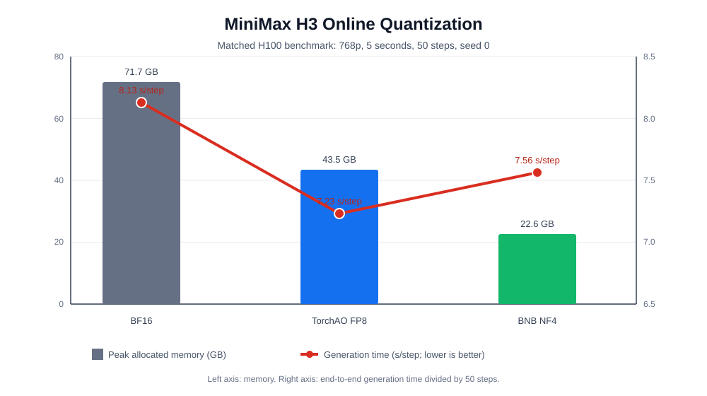

# MiniMax H3 Online Quantization Support

## Summary

This change adds single-GPU online DiT quantization for MiniMax H3 with two backends:

- TorchAO FP8 dynamic activation and weight quantization (`torchao-fp8`)
- bitsandbytes NF4 weight-only quantization with BF16 compute (`bnb-nf4`)

The quantized DiT is loaded from the original BF16 checkpoint, moved to CUDA after text encoding, converted on the
first denoising request, and kept resident for the remainder of the pipeline lifetime. The implementation converts
258 Linear layers across the main and token-refiner transformer blocks while preserving the reference dtype of the
FP32 projections, text encoder, and VAEs.

## Motivation

MiniMax H3's BF16 DiT profile requires most of an 80 GB H100. Online quantization provides a practical single-GPU
deployment option while retaining the existing checkpoint format, pipeline API, service contracts, and audio-video
output format.

## Implementation

- Added `MiniMaxH3DiT.enable_quant()` dispatch for TorchAO FP8 and BNB NF4.
- Added public `quantization` loading support and validation for CUDA, single-GPU execution, and FSDP exclusion.
- Added first-use quantization and allocator cache release in the denoising stage.
- Added dedicated H100 examples:
  - `examples/minimax_h3/minimax_h3_fl2va_torchao_fp8_h100.py`
  - `examples/minimax_h3/minimax_h3_fl2va_bnb_nf4_h100.py`
- Added `--quantization` to the existing FL2VA, Ref2VA, and JSON request examples.
- Added a reproducible benchmark at `tools/validation/benchmark_minimax_h3_quantization.py`.
- Added model, pipeline, loader, CLI, registry, and service-contract parity tests.
- Documented the lifecycle, backend behavior, constraints, and commands in `examples/minimax_h3/README.md`.

## Benchmark Method

The matched benchmark uses one NVIDIA H100 80 GB, MiniMax H3 FL2VA, 768p 16:9 output, five seconds, 50 inference
steps, seed `0`, and the prompt:

> Steam rises from the ramen while the family talks in the background.

The memory value is the runtime allocator's peak allocated bytes converted to decimal GB. The throughput value is
end-to-end `generation_seconds / 50`, so lower values are better. BF16 was measured on an H100 of the same model;
the final FP8 and NF4 runs were measured serially on an idle H100 to avoid unrelated GPU contention.

| Precision | Backend | Peak allocated memory | Peak reserved memory | Generation time | s/step | Change vs BF16 |
|---|---|---:|---:|---:|---:|---:|
| BF16 | Reference | 71.66 GB | 75.38 GB | 406.33 s | 8.13 s/step | Baseline |
| FP8 | TorchAO | 43.49 GB | 59.38 GB | 361.29 s | 7.23 s/step | 11.1% faster, 39.3% less allocated memory |
| NF4 | bitsandbytes | 22.62 GB | 55.97 GB | 378.05 s | 7.56 s/step | 7.0% faster, 68.4% less allocated memory |

FP8's core denoising time is 283.67 s, 4.3% below BF16. NF4's core denoising time is 298.13 s, effectively neutral
and 0.6% above BF16; its main benefit is memory reduction and avoiding the BF16 DiT offload footprint.

## Generated Video Comparison

The video file cells are intentionally blank for attaching or embedding the final review media.

| Precision | Backend | Video file | Visual/audio observation |
|---|---|---|---|
| BF16 | Reference |  | Reference generation for comparison |
| FP8 | TorchAO |  | PSNR 21.52, SSIM 0.729, audio cosine 0.626 versus BF16; composition and lighting remain close |
| NF4 | bitsandbytes |  | PSNR 14.45, SSIM 0.472, audio cosine 0.283 versus BF16; coherent scene, but composition and details diverge |

All three finalized artifacts are H.264 1344x768 at 24 fps with AAC 32 kHz stereo audio and 5.175 seconds of media.

## Validation

- Unit tests were not rerun after syncing latest main, as requested; the migrated test changes are included for CI review.
- Python source compilation, Ruff linting, formatting, and whitespace checks pass on the rebased files.
- `ruff check` and `ruff format --check` pass for all changed Python files.
- `git diff --check` passes.
- The benchmark numbers and generated-media comparison above come from the completed H100 validation of the implementation path.

Unit tests and full GPU generation were intentionally not rerun after the fork synchronization; no claim is made here about post-sync test execution.

## Constraints And Follow-Up

- Online quantization currently requires one CUDA device, `tp_degree=1`, `ulysses_degree=1`, and FSDP disabled.
- TorchAO's first conversion has a transient memory peak near the BF16 footprint; an otherwise idle 80 GB H100 is
  recommended.
- PSNR, SSIM, and audio cosine compare fixed-seed trajectories against BF16. They are regression indicators, not an
  absolute perceptual quality score.

## Contribution Checklist

- [x] Code follows the repository's ruff and formatting rules.
- [x] Tests were added for new quantization and lifecycle behavior.
- [x] Documentation and runnable examples were updated.
- [x] Prior implementation validation includes real H100 generation checks; post-sync UT was intentionally not rerun.
- [ ] Review video attachments: intentionally left blank in the comparison table above.
