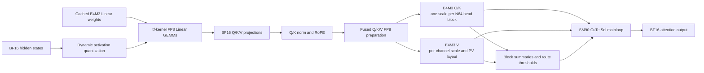
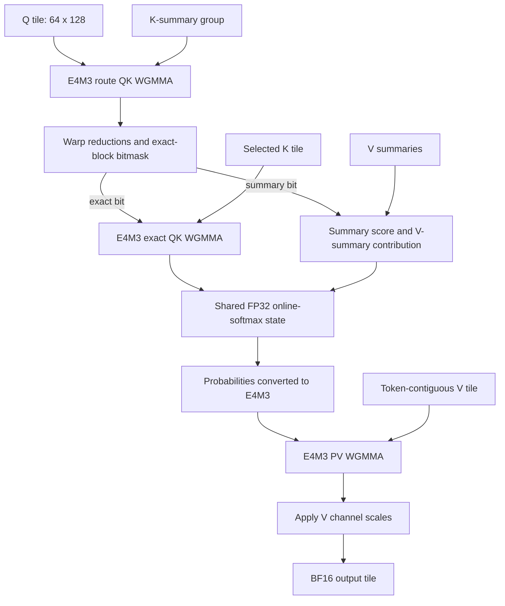

# FP8 Sol-Attn: Quantized Sparse Attention for Video DiTs on H100

Video diffusion transformers spend most of their denoising time in two different matrix-multiplication families:
Linear layers in projections and feed-forward networks, and the QK/PV products inside attention. Quantizing only
Linear layers reduces weight traffic and model memory, but leaves long-sequence attention in BF16. Enabling sparse
attention reduces the number of exact KV blocks, but does not by itself use Hopper FP8 Tensor Cores.

TeleFuser combines these optimizations without treating them as one interchangeable backend:

- source-built `tf-kernel` provides dynamic W8A8 E4M3 Linear GEMMs;
- TeleFuser quantizes post-RoPE Q/K/V with attention-specific scale and layout policies; and
- the built-in SM90 CuTe Sol-Attn mainloop executes routed E4M3 QK and PV WGMMA with FP32 accumulation.

The result is an independently configurable path for Wan2.1 and MiniMax-H3. BF16 Dense remains the default. This
article explains the ownership boundary, kernel data flow, quality protections, and the measured single-H100 result.

Sol-Attn itself is prior work from NVIDIA's Sol-Engine. TeleFuser does not claim a new sparse-attention algorithm,
FP8 format, or Tensor Core primitive. The contribution described here is the framework and kernel engineering needed
to carry block-scaled FP8 operands through Sol routing and exact attention, while preserving model-specific dense
regions and existing fallbacks.

## Validation Snapshot

| Field | Value |
|---|---|
| Status | `validated` |
| Implementation revision | `b649f0e` |
| Validation date | 2026-08-19 |
| GPU | 1 x NVIDIA H100 80 GB HBM3 (SM90) |
| Software | Python 3.11.13, PyTorch 2.11.0+cu128, CUDA 12.8 |
| Optional extension | Source-built SM90 `tf-kernel` wheel for FP8 Linear GEMMs |
| Attention kernel | Built-in TeleFuser CuTe DSL SM90 Sol-Attn |
| Validated models | Wan2.1-T2V-1.3B and MiniMax-H3 FL2VA |

These are point measurements for the stated hardware, revisions, prompts, and cold-start policy. They are not
performance or quality guarantees for another model, sequence length, GPU, or software stack.

## The Boundary: Linear GEMM Is Not Attention GEMM

The existing `tf_kernel.fp8_scaled_mm` operator accepts two-dimensional matrices and their scales. TeleFuser uses it
to replace selected `nn.Linear` modules:

1. cache each weight matrix in E4M3 with one scale per output channel;
2. quantize each activation row to E4M3 at runtime; and
3. run the scaled GEMM with a BF16 output.

That operator accelerates projections and feed-forward layers. It cannot directly execute
`softmax(QK^T)V`, build a dynamic Sol route, maintain online-softmax state, or merge exact and approximate KV blocks.
The FP8 Sol-Attn kernel is therefore not a duplicate implementation of `tf-kernel` FP8 GEMM. It consumes four-dimensional attention operands and owns the QK, softmax, PV, and sparse-route data flow.

| Path | Owner | Input contract | Work performed |
|---|---|---|---|
| FP8 Linear | `tf-kernel` through `telefuser.ops.fp8_gemm` | 2D E4M3 activation and weight matrices | Projection and FFN GEMM, BF16 output |
| FP8 QKV preparation | `telefuser.ops.fp8_attention` | Post-RoPE BF16 `[B,T,H,128]` | Scale calculation, E4M3 conversion, V relayout |
| FP8 Sol-Attn | `telefuser.kernel.sol_attn` | E4M3 Q/K/V plus FP32 scales | Routing, exact/approx attention, online softmax, BF16 output |

Keeping these layers separate also allows controlled ablations: FP8 Linear can run with dense BF16 attention, and
BF16 Linear can run with BF16 Sol-Attn.

## Design Goals, Non-Goals, and Alternatives

The implementation was designed to:

- preserve BF16 Dense as the unchanged default and expose FP8 Linear and FP8 attention independently;
- keep model code on `telefuser.ops` while architecture-specific dispatch stays below the public ops boundary;
- use native Hopper FP8 Tensor Cores for QK and PV, with FP32 accumulation and BF16 output;
- avoid materializing the full attention matrix or a global route mask;
- support exact KV sinks, dense step/layer guards, partial FP8 layer ranges, and non-aligned token tails; and
- retain a BF16 fallback for unsupported contracts and runtime failures.

It was not intended to replace `tf-kernel` Linear GEMM, change checkpoint serialization, quantize text encoders or VAEs, make every attention variant FP8, or claim that every FP8 configuration must be faster.

Several alternatives were measured or rejected during development:

- **Reuse `tf_kernel.fp8_scaled_mm` for attention.** Its 2D GEMM contract cannot express online softmax, dynamic
  routing, block sinks, or exact/summary merging.
- **Keep Q/K/V in BF16 after FP8 Linear.** This is a useful memory and Linear-throughput ablation, but leaves QK/PV
  on the BF16 path and does not satisfy the attention optimization goal.
- **Route FP8 Q/K/V through the Triton reference path on H100.** It provides portability and a fallback, but its
  conversion, launch, and Tensor Core utilization were slower than the specialized CuTe mainloop at production shapes.
- **Quantize every attention layer.** This maximized FP8 coverage but caused visible video degradation. Partial-layer
  controls retained the measured speedup with a better quality boundary.

## End-to-End Data Flow



This is a fused attention mainloop, not a claim that the full graph is one CUDA kernel. QKV quantization and centroid
preprocessing remain separate Triton kernels. The mainloop fuses the expensive routed/exact QK, online softmax, and PV
work so it does not materialize a full attention matrix or a global dense routing mask.

## Attention-Specific FP8 Preparation

Q, K, and V are quantized after Q/K normalization and RoPE. Quantizing earlier would require the following operators
to understand FP8 scales and would move the quantization boundary away from the values actually consumed by
attention.

For every batch, head, and 64-token Q or K block, TeleFuser computes one E4M3 scale:

$$
s_{q,bh} = \frac{\max |Q_{b,h,64\text{-token block},:}|}{448}, \qquad
s_{k,bh} = \frac{\max |K_{b,h,64\text{-token block},:}|}{448}.
$$

V uses one scale per batch, head, and channel across the token dimension:

$$
s_{v,bhd} = \frac{\max_t |V_{b,t,h,d}|}{448}.
$$

The fused SM90 preparation path uses two Triton launches. The first reads BF16 Q/K/V once, writes E4M3 Q/K and
their block scales, and accumulates V-channel maxima. The second quantizes V directly into token-contiguous backing
storage. That layout is still exposed as `[B,T,H,D]`, but makes the token dimension contiguous for the K-major PV
WGMMA operand and avoids a separate transpose before attention.

The fallback preparation path uses the same public scale contract with PyTorch operations. This keeps model code on
the public ops layer and makes unsupported devices testable without importing the CuTe backend.

## Sol Routing

Sol-Attn partitions the sequence into 64-token Q and KV blocks. Preprocessing builds a K summary and a V summary for
each KV block. For each Q block and head, the `diag` or `exact` estimator derives a threshold of the form

$$
\theta = \mu + \tau\sigma,
$$

where the exact estimator retains the full second moment and the diagonal estimator uses only per-channel variance.
The CuTe mainloop evaluates Q against groups of K summaries, reduces the distributed WGMMA accumulator into route
scores, and creates a CTA-local exact-block bitmask.

- Important blocks take the **exact route** and execute full QK, online softmax, and PV.
- Remaining blocks take the **summary route**, using the K/V summaries with block-length correction.
- Configured sink blocks are always exact, regardless of their route score.

The summary route is not equivalent to dropping a KV block. It retains a compressed contribution in the same online-softmax state. The threshold controls how much work is promoted back to exact attention.

## The SM90 CuTe Mainloop

The Hopper specialization uses 64x64 QK tiles, head dimension 128, one 128-thread warpgroup, TMA K/V movement, and
WGMMA Tensor Core instructions. Its FP8 path adds the following work to the upstream BF16 structure:

1. **Scale-aware route QK.** Block-scaled Q and quantized K summaries run through E4M3 WGMMA. Their FP32 accumulator
   is multiplied by the corresponding Q and K-summary scales before routing decisions.
2. **In-mainloop route-mask construction.** Warp-local reductions convert route accumulators into a compact exact-block bitmask. Full groups and static tails have separate compile-time specializations.
3. **Exact E4M3 QK.** Selected KV blocks execute QK WGMMA into FP32, followed by scale application and online
   softmax.
4. **Approximate summary contribution.** Non-exact columns consume the precomputed summaries and correct both the
   numerator and denominator for the current KV-block length.
5. **E4M3 PV.** Post-softmax probabilities are converted to E4M3 and multiplied by token-contiguous E4M3 V. The V
   channel scale is applied to the FP32 output accumulator after all PV contributions.
6. **One online-softmax merge.** Exact and summary routes update the same row maxima, row sums, and output
   accumulator. The full attention matrix is never written to HBM.
7. **Split-KV for long sequences.** On SM90, `auto` selects two splits for FP8 sequences at or above 16,384 tokens
   and four splits at or above 65,536 tokens. A final log-sum-exp reduction merges the partial outputs.



The kernel cache key includes device, architecture, batch, token count, head count, KV splits, and input dtype. This
prevents a BF16 specialization from being reused for E4M3 inputs and makes the first-execution compilation cost
explicit in cold-start measurements.

## Diffusion Quality Protections

FP8 error and sparse-routing error accumulate across many denoising layers and steps. TeleFuser exposes three
orthogonal controls instead of forcing one all-layer policy:

- `dense_timesteps` keeps early, high-noise-sensitive denoising steps dense;
- `dense_layers` keeps the first transformer layers dense at every sparse step; and
- `sol_fp8_layer_start` / `sol_fp8_layer_end` restrict E4M3 Q/K/V to a half-open layer range.

Wan2.1 uses FP8 attention only in layers 10-19 in the validated profile. This retained the measured performance while
avoiding the visible degradation observed when every attention layer used FP8 Q/K/V.

MiniMax-H3 has a packed multimodal sequence, so it needs two additional protections. The complete conditioning
prefix is registered as an exact KV sink, and prefix queries are recomputed with BF16 dense attention. The first ten
steps and first two DiT layers also use matched packed FlashAttention-4. Token-refiner attention remains dense.

Unsupported shapes, dtypes, devices, or runtime kernel failures retain the public attention fallback. FP8 operands
are dequantized before the BF16 fallback. Ring/USP attention remains dense because its online distributed merge needs
log-sum-exp behavior outside the current Sol contract.

## Performance Results

### MiniMax-H3 FL2VA

Each configuration ran in an independent clean process on one H100 80 GB with no other GPU processes. The workload
used the official complex starship T2VA prompt, 1344x768 output, 124 frames at 24 FPS, a five-second request, 50
denoising steps, and seed 0. Timing includes first-execution kernel/JIT costs. `denoising_steps_per_second` is
`50 / runtime_metrics["denoising_seconds"]`; peak memory is `torch.cuda.max_memory_allocated()` during generation.
End-to-end generation excludes MP4 saving.

In this table, **FP8 Dense** means FP8 Linear GEMMs with BF16 FlashAttention-4. Only **FP8 Sol** quantizes Q/K/V.

| Linear | Attention | Denoising time | Throughput | Peak allocated | Generation time |
|---|---|---:|---:|---:|---:|
| BF16 | Dense FA4 | 310.409 s | 0.1611 step/s | 65.67 GiB | 457.5 s |
| BF16 | Sol-Attn | 213.442 s | 0.2343 step/s | 67.21 GiB | 321.3 s |
| FP8 | Dense FA4 | 276.836 s | 0.1806 step/s | 35.94 GiB | 397.5 s |
| FP8 | FP8 Sol-Attn | **188.185 s** | **0.2657 step/s** | **38.14 GiB** | **308.6 s** |

FP8 Sol-Attn improves denoising throughput by **65.0%** over BF16 Dense while reducing peak allocated memory by
**41.9%**. Against FP8 Dense, Sol routing adds **47.1%** throughput for a **6.1%** memory increase. The ablation shows
that Sol provides most of the compute reduction, while FP8 Linear provides most of the model-memory reduction.

The Sol rows use more memory than their matching dense rows because centroids, thresholds, route state, output/LSE,
and optional split-KV workspaces are live in addition to Q/K/V. Sol is a compute optimization, not a guarantee of
lower attention workspace.

### Wan2.1-T2V-1.3B

The Wan cold-start run used 832x480, 81 frames, 50 UniPC steps, CFG 5.0, sigma shift 5.0, seed 42, and the official
boxing-cats prompt. Timing starts after model loading, includes first-execution kernel/JIT cost, and excludes MP4
encoding. Both FP8 rows quantize all 300 transformer-block Linear layers and restrict E4M3 Q/K/V to layers 10-19.

Here **FP8 Exact** is the exact QK/PV CuTe path with routing disabled; it is not BF16 dense attention.

| Linear | Attention | Throughput | Peak allocated |
|---|---|---:|---:|
| BF16 | Dense | 0.8491 frames/s | 16.147 GiB |
| BF16 | Sol-Attn | 1.1090 frames/s | 17.023 GiB |
| FP8 | FP8 Exact, layers 10-19 | 0.8739 frames/s | 15.730 GiB |
| FP8 | FP8 Sol-Attn, layers 10-19 | **1.1565 frames/s** | **15.730 GiB** |

FP8 Sol-Attn is **36.2%** faster than BF16 Dense and uses **2.6%** less peak allocated memory. The small 2.9% FP8 Exact gain also shows why quantization overhead must be measured: FP8 is not automatically faster when the matrices
are small or conversion and launch costs dominate.

## Output Validation

All four MiniMax-H3 profiles produced valid 1344x768 H.264 videos with 124 frames and synchronized AAC audio. Manual
midpoint-frame inspection found coherent content and no black frames or obvious numerical failure. This is a smoke
test, not a perceptual-quality study; structural similarity between independently diverging diffusion trajectories
must not be interpreted as an absolute video-quality score.

For Wan, matching-attention comparisons measured 22.0257 dB PSNR / 0.828783 SSIM for FP8 Exact and 20.8502 dB PSNR /
0.792656 SSIM for FP8 Sol. The partial attention-layer range was selected after an all-layer FP8 run showed visible
degradation.

Correctness coverage includes scale forwarding, dense guards, exact sinks, non-aligned token tails, constant-value
preservation, split-KV route weights, public-op fallback, and real H100 FP8 Sol execution. The full unit suite at the
validated revision completed with **1,639 passed and 11 skipped** tests.

## Reproduction

Build and install an SM90 `tf-kernel` wheel using its repository Makefile, then run from the TeleFuser repository
root. The CuTe Sol-Attn implementation is already packaged with TeleFuser.

MiniMax-H3 ablation:

```bash
python -m tools.validation.benchmark_minimax_h3_quantization \
  --model-root /path/to/MiniMax-H3 \
  --backend fp8-sol \
  --prompt-file /path/to/demo_prompt.json \
  --duration 5 --steps 50 --seed 0 --aspect-ratio 16:9 \
  --output outputs/minimax_h3_fp8_sol.mp4 \
  --metrics-json outputs/minimax_h3_fp8_sol.metrics.json
```

Repeat with `--backend bf16`, `bf16-sol`, `fp8`, and `fp8-sol`. Use a fresh process for every profile if comparing
the cold path.

Wan2.1 FP8 Sol:

```bash
python examples/wan_video/wan21_1_3b_text_to_video_optimized_h100.py \
  --model-root /path/to/Wan2.1-T2V-1.3B \
  --prompt "Two anthropomorphic cats in comfy boxing gear and bright gloves fight intensely on a spotlighted stage." \
  --attention fp8-sol --quantization tf-kernel-fp8 \
  --fp8-linear-scope all --fp8-layer-start 10 --fp8-layer-end 20 \
  --width 832 --height 480 --num-frames 81 --num-inference-steps 50 \
  --sample-solver unipc --cfg-scale 5.0 --sigma-shift 5.0 --seed 42
```

## Limitations

- The validated FP8 attention mainloop targets SM90, noncausal self-attention, equal Q/K/V shapes, and head dimension
  128. BF16 Sol has broader architecture fallbacks, but the performance result does not transfer to them.
- MiniMax-H3 online `tf-kernel` FP8 Linear quantization is currently single-GPU only. Its TP/FSDP loading contract
  remains BF16.
- QKV quantization and centroid preprocessing are separate kernels. Further fusion may reduce launch and memory-traffic overhead, but would increase specialization and register pressure.
- CuTe compilation is shape- and dtype-specific. Cold-start latency includes compilation; persistent services should
  evaluate warm steady state separately.
- The best FP8 layer range is model- and checkpoint-dependent. An all-layer setting should not be treated as the
  default quality/performance point.
- Peak allocated memory is a CUDA allocator metric, not total process or device memory. The experiments report one
  run per configuration and do not establish variance bounds.

## Related Work

[Sol-Attn](https://arxiv.org/abs/2607.24027) and the
[Sol-Engine implementation](https://github.com/NVlabs/Sana/tree/sol-engine) define the dynamic summary/exact routing
algorithm and architecture-specific sparse-attention kernels used as the starting point. TeleFuser adapts that work
to its public attention dispatch, model runtime state, packed multimodal sequences, exact sinks, and independent
quantization configuration.

[FlashAttention](https://arxiv.org/abs/2205.14135) established tiled IO-aware exact attention with online softmax.
The CuTe mainloop here retains that execution structure while adding Sol routing and FP8 scale handling. NVIDIA
Hopper WGMMA and TMA provide the hardware primitives; TeleFuser does not claim those primitives or E4M3 arithmetic as
new.

The narrower contribution is a validated composition: dynamic W8A8 Linear GEMMs, post-RoPE block-scaled FP8 QKV,
layout-aware V preparation, and a scale-aware routed/exact SM90 mainloop, exposed behind reversible model
configuration and guarded by full-pipeline quality checks.
