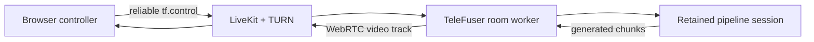

# LingBot-World v2 WebRTC Core Experience

This walkthrough exercises TeleFuser's core path: browser controls cross a LiveKit WebRTC room, a retained world-model
session generates the next video chunk, and the result returns as a live media track. Run the transport preflight
first so signaling and TURN failures are separated from model or GPU failures.


The browser demo combines the generated video, translation and rotation controls, session actions, runtime metrics,
and LiveKit messages in one view.

## What This Validates

| Stage | Model required | Success signal |
| --- | --- | --- |
| WebRTC preflight | No | Moving test pattern reaches the browser and the D-pad follows held controls |
| LingBot-World v2 | Yes, four H100 profile below | Camera controls produce new world-model chunks in the same room |



## Requirements

Complete [Installation](installation.md), then verify the development services:

```bash
command -v livekit-server
command -v turnserver
telefuser stream-serve --help
```

The browser demo forces a local TCP TURN relay. The commands below use development credentials and loopback
addresses; they are not production configuration.

The service commands clear proxy variables so the local LiveKit SDK connects directly to loopback signaling.

### LingBot-World v2 Hardware and Weights

The validated profile uses four H100 GPUs. Set the model zoo root to a directory with this layout:

```text
${TF_MODEL_ZOO_PATH}/
├── Wan2.2-I2V-A14B/
│   ├── Wan2.1_VAE.pth
│   └── models_t5_umt5-xxl-enc-bf16.pth
└── lingbot/
    └── lingbot-world-v2-14b-causal-fast/
        └── transformers/
            ├── model-00001-of-00008.safetensors
            └── ... model-00008-of-00008.safetensors
```

Verify the inputs before loading GPUs:

```bash
export TF_MODEL_ZOO_PATH=/path/to/model_zoo
test -f "$TF_MODEL_ZOO_PATH/Wan2.2-I2V-A14B/Wan2.1_VAE.pth"
test -f "$TF_MODEL_ZOO_PATH/Wan2.2-I2V-A14B/models_t5_umt5-xxl-enc-bf16.pth"
test -f "$TF_MODEL_ZOO_PATH/lingbot/lingbot-world-v2-14b-causal-fast/transformers/model-00008-of-00008.safetensors"
```

The initial image, camera poses, and intrinsics are already under `examples/data/lingbot_world_fast/`.

## 1. Verify WebRTC Without a Model

Run the development stack from the repository root in four terminals.

Terminal 1, TCP TURN relay:

```bash
turnserver -n -m 1 \
  --listening-ip=127.0.0.1 --relay-ip=127.0.0.1 \
  --listening-port=3478 --min-port=49160 --max-port=49200 \
  --user=livekit-demo:livekit-demo-password --realm=livekit.local \
  --fingerprint --lt-cred-mech --no-tls --no-dtls --no-cli \
  --allow-loopback-peers
```

Terminal 2, LiveKit signaling and SFU:

```bash
livekit-server --dev
```

Terminal 3, self-contained model-free bidirectional service:

```bash
env -u http_proxy -u https_proxy -u HTTP_PROXY -u HTTPS_PROXY -u all_proxy -u ALL_PROXY \
  telefuser stream-serve examples/stream_server/stream_arrow_overlay.py \
  --livekit-url ws://127.0.0.1:7880 \
  --livekit-api-key devkey \
  --livekit-api-secret secret \
  --port 8088 \
  --skip-validation
```

Terminal 4, browser controller and API proxy:

```bash
python examples/stream_server/livekit_bidirectional_demo.py \
  --server-url http://127.0.0.1:8088 \
  --port 8092 \
  --no-open
```

Confirm readiness:

```bash
curl --fail http://127.0.0.1:8088/v1/service/ready
curl --fail http://127.0.0.1:8088/v1/stream/health
```

Open `http://127.0.0.1:8092` and click **Start**. The preflight passes when the moving test pattern appears,
holding W/A/S/D highlights the matching D-pad directions, and **Stop** closes the session. Do not start the model
until this step works.

## 2. Run LingBot-World v2

Stop the preflight session and Terminal 3 only. Keep TURN, LiveKit, and the browser proxy running, then replace
Terminal 3 with the v2 service:

```bash
env -u http_proxy -u https_proxy -u HTTP_PROXY -u HTTPS_PROXY -u all_proxy -u ALL_PROXY \
  TF_MODEL_ZOO_PATH=/path/to/model_zoo \
  CUDA_VISIBLE_DEVICES=0,1,2,3 \
  telefuser stream-serve examples/lingbot/lingbot_world_v2_image_to_video_h100.py \
  --livekit-url ws://127.0.0.1:7880 \
  --livekit-api-key devkey \
  --livekit-api-secret secret \
  --worker-gpu-map 0,1,2,3 \
  --max-sessions-per-worker 1 \
  --control-idle-timeout 10 \
  --port 8088 \
  --skip-validation
```

Wait for `/v1/service/ready` to return HTTP 200. Refresh the browser page, select an initial image or use the
repository default, and click **Start**. The core experience passes when:

- the page receives a live video track rather than only showing the initial image;
- holding W/A/S/D or I/J/K/L causes newly generated chunks to reflect translation or rotation;
- releasing the controls returns generation to idle without closing the WebRTC room;
- **Stop** closes the HTTP session and releases retained model capacity.

## Remote Development

With VS Code Remote SSH, forward TCP ports `8092`, `7880`, `3478`, and `49160-49200` to the same local
ports. The browser page proxies the session API, so `8088` does not need browser-side forwarding.

The loopback TURN listener, static password, disabled TLS, `--allow-loopback-peers`, LiveKit development
credentials, and `--skip-validation` are for a trusted development host only.

## Next Steps

- [Stream Server](stream_server.md) defines room roles, admission, capacity, lifecycle, and production boundaries.
- [Streaming Scheduler](stream_scheduler.md) explains stage ownership and bounded chunk flow.
- [LingBot-World Cookbook](/TeleFuser/cookbook/lingbot-world/) documents offline validation and performance gates.
- [Basic Inference Quickstart](quickstart.md) provides a smaller single-GPU package and batch-API check.
