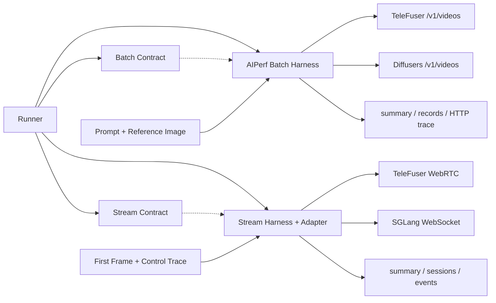
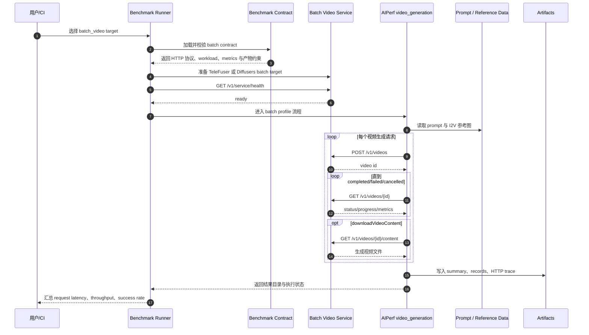
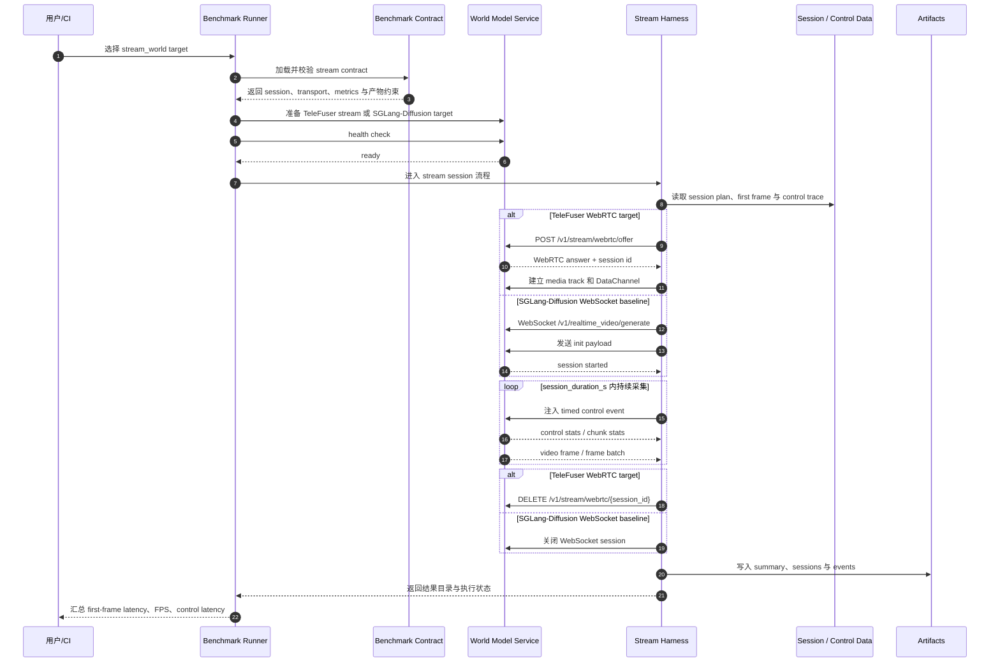
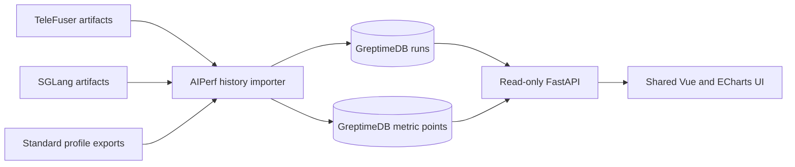

# TeleFuser 与 AIPerf Benchmark 设计

本文档记录 benchmark 的设计决策、架构边界、协议契约和资产组织。运行方式、环境变量和结果查看方法见[用户文档](benchmark_aiperf.md)。

## 1. 设计目标与对标原则

本设计将离线异步生成和实时流式交互拆成两种模式。两者的生命周期、并发单位和指标语义不同，因此分别定义 contract、harness 和结果产物。

| 模式 | 设计目标 | 核心观测 | 对标对象 |
| --- | --- | --- | --- |
| `batch_video` | 评估异步视频生成链路 | submit、poll、download 的端到端时延、吞吐和成功率 | 固定 Wan2.1-I2V-14B-480P，对比 TeleFuser 与 Diffusers |
| `stream_world` | 评估长 session 的持续帧输出和双向控制 | 首帧时延、稳定 FPS、控制确认和控制到下一帧时延 | 固定 LingBot world-model 语义，对比 TeleFuser WebRTC 与 SGLang-Diffusion WebSocket |

核心设计原则：

- **控制变量**：正式对标必须固定模型、任务、输入、输出形状和控制 trace，只替换推理框架及其必要的协议适配。
- **场景隔离**：`batch_video` 与 `stream_world` 独立计量，完整视频吞吐与实时 session FPS 不交叉解释。
- **契约与黑盒**：contract 定义可测协议；target service 的并行、batching 和调度实现只通过结果指标与 server metrics 观测。
- **传输归一化**：stream adapter 隔离 WebRTC 和 WebSocket 的 wire protocol 差异，输出统一的 session result。
- **证据分级**：正式配置用于性能对比；降级配置和 mock 只用于连通性或传输层验证。

## 2. 整体架构与依赖边界

Benchmark 体系包含 contract、runner、harness、target service、input data 和 artifacts 六类组件。



组件定义：

- **Contract**
  - 定位：benchmark target 的协议契约，是 harness 与 target service 之间的稳定边界。
  - 声明内容：
    - `contract_version`：contract schema 版本。
    - `name`：target contract 的唯一名称。
    - `mode`：benchmark 场景类型，例如 `batch_video` 或 `stream_world`。
    - `implementation`：被测实现类型，例如 `telefuser`、`diffusers` 或 `sglang_diffusion`。
    - `model_family`、`model` 和 `supported_tasks`：模型语义与任务边界。
    - `transport`：harness 与 target service 的通信方式，例如 HTTP、WebRTC 或 WebSocket。
    - `endpoint`、`request_encoding` 和 `result_delivery`：服务路径、请求编码与结果返回方式。
    - `workload`：固定负载参数，包括模型、任务、分辨率、帧数、FPS、steps、seed 或 control trace。
    - `metrics`：该 target 允许解释的指标集合，例如 latency、throughput、FPS、control latency 或 success rate。
    - `limits`：active sessions 等 target 能力约束。
    - `artifacts`：配置、数据、脚本和结果产物的索引，用于自动化和结果复查。
  - 边界：只描述“如何被测”和“产出什么”，不描述服务部署流程或模型内部实现。

- **Runner**
  - 定位：benchmark 编排入口。
  - 职责：
    - 选择 target 并加载 contract。
    - 确认 target service 可测后启动 harness。
    - 返回执行状态和结果目录。
  - 边界：不解释模型内部行为，不直接承担协议适配和指标计算。

- **Harness**
  - 定位：实际发起请求或 session 的测试执行器。
  - 职责：
    - 控制请求或 session 并发及其生命周期。
    - 记录事件时间并调用 transport adapter。
    - 将观测结果归一化为 mode 对应的指标和产物。
  - 边界：不加载模型，不改变 workload 语义。

- **Target service**
  - 定位：被测服务或 baseline 服务。
  - 职责：
    - 加载模型并执行调度和推理。
    - 维护 task 或 session 状态并生成媒体。
  - 边界：在 benchmark 视角下被当作黑盒，只通过 contract 暴露的协议面交互。

- **Input data**
  - 定位：固定 workload 的输入资产。
  - 内容：
    - Batch 使用的 prompt、参考图和请求顺序。
    - Stream 使用的 first frame、timed control trace 和 session 顺序。
  - 边界：只保证不同 target 的输入语义一致，不携带 transport-specific 计时逻辑。

- **Artifacts**
  - 定位：benchmark 输出产物。
  - 内容：
    - `summary`：benchmark 级聚合结果，记录吞吐、时延、成功率、FPS 等可用于横向对比的汇总指标。
    - `records`：Batch 场景的请求级明细，记录单次请求的生命周期、状态、时延和错误信息。
    - `sessions`：Stream 场景的 session 级明细，记录连接状态、持续时间、帧统计和控制统计。
    - `events`：Stream 场景的事件级时间线，记录帧接收、控制发送、确认、状态变化和异常事件。
    - `HTTP trace`：Batch 场景的 HTTP 交互轨迹，记录 submit、poll、download 等协议阶段的请求与响应信息。
    - `server metrics`：target service 的服务端观测数据，记录资源使用率、runtime 状态以及框架特有指标。
  - 边界：按 benchmark mode 独立落盘，不混合 Batch 与 Stream 的结果语义。

仓库边界：

- **指标观测工具的唯一实现边界是 `ActivePeter/aiperf` 的 `teleai` 分支。** 采集生命周期、Prometheus
  解析、原始记录模型、聚合、导出、统一语义映射和流式事件关联均在该分支实现，不在 TeleFuser 中维护第二套实现。
- `benchmarks/telefuser_aiperf/` 只保留 TeleFuser target 的声明式 contract、配置、输入数据和薄启动入口。
  `run_stream_bench.py` 与 `run_stream_bench.sh` 仅将目标配置转交给 `aiperf profile --stream-config`；session
  执行、指标汇总和产物导出均由 AIPerf 完成。
- `benchmarks/baseline/` 只承载 baseline service wrapper、声明式 contract 和必要的 wire adapter 配置；不同 baseline
  必须对齐同一 workload 与可观测协议，不能各自实现指标计算器。
- `benchmarks/aiperf/` 是 [setup 脚本](../../scripts/setup_aiperf_repo.sh)拉取的外部 checkout，不 vendor 到
  TeleFuser。正式结果必须记录并固定 `teleai` commit，不能只记录可移动的分支名。

### 2.1 外部依赖与接入形式

外部依赖按源码影响分为三类：

- **外部包装**：在 AIPerf 中实现跨系统 adapter；TeleFuser 仓库只写 service wrapper、contract、config 或 mock，不改变第三方库行为。
- **运行时 shim**：不改第三方文件，但通过 `PYTHONPATH`、`sitecustomize.py` 或 monkey patch 改变其行为。
- **上游源码修改**：直接修改第三方源码，或维护带 patch 的外部 fork。

| 外部依赖 | 接入形式 | 源码影响 | 版本与 Fork 决策 |
| --- | --- | --- | --- |
| AIPerf | [setup 脚本](../../scripts/setup_aiperf_repo.sh)将 `ActivePeter/aiperf` 的 `teleai` 分支拉取到 `benchmarks/aiperf/`；Batch 复用 `video_generation` 和 `server_metrics`，Stream 能力在同一分支内演进 | **有**：benchmark 与指标观测功能只修改外部 fork；TeleFuser 主仓只保留声明式接入资产 | 当前唯一落点为 `teleai`；正式运行 pin commit，接口稳定后再单独决定是否回流 upstream |
| Diffusers | wrapper 将 `WanImageToVideoPipeline` 暴露为 `/v1/videos` | **否**：仅新增外部包装 | 不需要 fork；改变 pipeline 语义时再升级为 fork |
| SGLang-Diffusion | AIPerf adapter 接入 `sglang.multimodal_gen` 和 WebSocket endpoint | 窄协议插桩：原生 `chunk_stats` 增加已有 `OutputBatch.peak_memory_mb`；环境 shim 仍只处理缺失依赖或不兼容 kernel | 指标字段应落入版本化 SGLang 分支或 upstream PR；SGLang 不依赖 AIPerf 包 |
| WebRTC / aiortc | AIPerf adapter 执行 offer/answer、media track 和 DataChannel；TeleFuser 只暴露服务面 | **否**：客户端 ICE 策略位于 AIPerf，服务端策略位于 TeleFuser | 不需要 fork |
| WebSocket / MessagePack | adapter 编解码 `init`、`camera_actions`、`chunk_stats` 和 `frame_batch` | **否**：不修改 `websockets` 或 `msgspec` | 不需要 fork |
| 模型权重与输入数据 | 各 runtime 加载模型，benchmark 固定 workload 和输入 | **否**：不修改权重 | 配置修正单独版本化，必要时维护模型侧 fork |

Fork 决策以性能语义为界。Wrapper、contract、config 和 mock 不需要 fork；改变 runtime、kernel fallback 或模型加载语义的改动必须进入版本化 fork 或 upstream。未版本化的 shim 不能作为正式性能结论的基础。

## 3. 执行时序与并发模型

### 3.1 Batch Video 并发模型

Batch 以视频生成请求为并发单位。每个请求持有独立 `video id`，poll 和可选 download 均归属该 id。



并发与计量边界：

- 并发单位：单次 HTTP video request，由 AIPerf 的 concurrency、request count、duration 和到达率模型驱动。
- 状态隔离：每个请求的 `video id` 独立，poll 和 download 不跨请求复用。
- 计量范围：从 submit 覆盖到终态；启用媒体下载时，download 计入端到端时延。

### 3.2 Stream World 并发模型

Stream 以 session 为并发单位。帧接收、控制注入和状态变化都记录在同一 session 时间线内。



并发与计量边界：

- 并发单位：session，由 `session_count` 和 `stagger_s` 描述 session 数量与错峰策略。
- 生命周期：`session_duration_s` 内的控制、帧和状态事件不能解释为独立请求。
- 当前限制：`LingBotWorldFastService` 只允许一个 active session，因此当前结果按单 session 解释；多 session 参数为后续扩展保留。

## 4. 契约、协议与观测模型

### 4.1 Contract 设计

第 2 节定义 contract schema。本节列出各 target 的 contract 实例及其协议责任。

| Contract | Target | Mode | Implementation | Transport | 设计责任 |
| --- | --- | --- | --- | --- | --- |
| [TeleFuser Batch](../../benchmarks/telefuser_aiperf/benchmark_contract.yaml) | Wan2.1-I2V | `batch_video` | `telefuser` | `http` | 声明 `/v1/videos` workload 与产物 |
| [Diffusers Batch](../../benchmarks/baseline/diffusers_wan_i2v/benchmark_contract.yaml) | Wan2.1-I2V baseline | `batch_video` | `diffusers` | `http` | 对齐 TeleFuser fixed workload 与 HTTP 面 |
| [TeleFuser Stream](../../benchmarks/telefuser_aiperf/stream_benchmark_contract.yaml) | LingBot stream | `stream_world` | `telefuser` | `webrtc` | 声明 offer、DataChannel、media track 与指标 |
| [SGLang Stream](../../benchmarks/baseline/sglang_lingbot_stream/benchmark_contract.yaml) | LingBot baseline | `stream_world` | `sglang_diffusion` | `websocket` | 声明 MessagePack init/control/frame batch 语义 |

### 4.2 Batch Video HTTP 协议边界

`batch_video` 的协议边界统一收敛到 OpenAI-compatible `/v1/videos` 异步任务模型。

| 协议面 | 路径或字段 | 设计约束 |
| --- | --- | --- |
| Health | `GET /v1/service/health` | 只表达服务可测状态，不承载 workload 参数 |
| Submit | `POST /v1/videos` | 创建独立 video task，返回 `video id` |
| Poll | `GET /v1/videos/{id}` | 读取状态、进度和任务级 metrics |
| Content | `GET /v1/videos/{id}/content` | 下载生成媒体，用于端到端 download latency 计量 |
| Cancel/Cleanup | `DELETE /v1/videos/{id}` | 释放任务状态或取消未完成任务 |

最小请求字段：

- `prompt`
- `model`
- `size`
- `seconds`
- `seed`
- `negative_prompt`
- `input_reference`
- `reference_url`

最小状态返回字段：

- `id`
- `status`
- `progress`
- `created_at`
- `completed_at`
- `error`
- `url`
- `file_path`
- `inference_time_s`
- `peak_memory_mb`

状态集合：

- `queued`
- `generating`
- `completed`
- `failed`
- `cancelled`

约束：

- AIPerf `video_generation` endpoint 负责把 single-turn 数据转换成 OpenAI video payload，并执行 submit/poll/download 生命周期。
- `extra` 字段仅允许承载生成参数，严禁覆盖 `input_reference` 或 `reference_url` 等由 endpoint 统一管理的媒体字段。
- TeleFuser 与 Diffusers baseline 必须暴露同一异步任务语义，避免 harness 分支逻辑影响对比结论。

### 4.3 Stream World 协议边界

`stream_world` 统一 session result 语义，但允许不同 transport。Adapter 将 WebRTC/DataChannel 和 WebSocket/MessagePack 事件映射到同一时间线与指标字段。

| 维度 | TeleFuser Target | SGLang-Diffusion Baseline | 归一化要求 |
| --- | --- | --- | --- |
| Health | `GET /v1/service/health` | `GET /health` | 只用于 target 可测状态判断 |
| Session start | `POST /v1/stream/webrtc/offer` | WebSocket `/v1/realtime_video/generate` + `init` message | 计入连接建立和 first metadata/first frame 时延 |
| Control channel | DataChannel label `telefuser` | WebSocket `event` message / `camera_actions` | 映射到统一 control event timeline |
| Media delivery | RTP video track | MessagePack `frame_batch` | 映射到 frame receive timeline 和 stream FPS |
| Metadata delivery | DataChannel status/chunk messages | MessagePack `chunk_stats` | 映射到 session event log 和 control ack 近似 |
| Session cleanup | `DELETE /v1/stream/webrtc/{session_id}` | WebSocket close | 结束 session lifecycle，不产生 batch request 语义 |

AIPerf streaming 目标复用层：

| 文件 | 设计角色 |
| --- | --- |
| [contracts.py](../../benchmarks/aiperf/src/aiperf/streaming/contracts.py) | contract 加载与校验 |
| [models.py](../../benchmarks/aiperf/src/aiperf/streaming/models.py) | `StreamSessionPlan`、`SessionResult` 和 summary 聚合 |
| [protocols.py](../../benchmarks/aiperf/src/aiperf/streaming/protocols.py) | workload、adapter 和 metrics collector 协议 |
| [transports.py](../../benchmarks/aiperf/src/aiperf/streaming/transports.py) | transport descriptor |
| [config.py](../../benchmarks/aiperf/src/aiperf/streaming/config.py) | `--stream-config` 类型化配置与安全加载 |
| [workload.py](../../benchmarks/aiperf/src/aiperf/streaming/workload.py) | contract 到统一 session plan 的转换 |
| [telefuser_webrtc.py](../../benchmarks/aiperf/src/aiperf/streaming/adapters/telefuser_webrtc.py) | TeleFuser WebRTC/RTP/DataChannel adapter |
| [sglang_websocket.py](../../benchmarks/aiperf/src/aiperf/streaming/adapters/sglang_websocket.py) | SGLang MessagePack WebSocket adapter |
| [profile.py](../../benchmarks/aiperf/src/aiperf/streaming/profile.py) | health、phase、server metrics 与自动产物编排 |

截至 2026-07-13，远端 `ActivePeter/aiperf` 的 `teleai` 分支指向 `d72160e20957013d6608afcc88ed24100cb27dc5`。
本地 `teleai` checkout 已实现并测试 `aiperf.streaming` 与 `aiperf.observability` 公共接口，但这些改动尚未提交或推送，
因此仍不能作为远端分支已发布该能力的证据。正式使用前必须提交到 `teleai`，并在结果中记录包含这些实现的新 commit。

### 4.4 指标观测协议与 AIPerf 收敛边界

指标观测按“客户端端到端事件 → 服务端原始指标 → 统一语义派生视图 → 关联分析”分层处理。所有工具代码收敛到
`ActivePeter/aiperf@teleai`；TeleFuser 和 baseline 只暴露被观测面，不依赖 AIPerf 的 Python 包，也不负责抓取、聚合或导出。

AIPerf 内的权威接口与协议说明见 [Multimodal Generation and Observability Contracts](../../benchmarks/aiperf/docs/benchmark-modes/multimodal-generation.md)。
本节只保留 TeleFuser 接入边界；两处语义冲突时以 AIPerf 文档和对应 schema 为准。

#### 4.4.1 当前能力与发布状态

| 能力 | 远端基线与本地 `teleai` 状态 | 设计结论 |
| --- | --- | --- |
| Prometheus 多端点采集 | 已提交，位于 `src/aiperf/server_metrics/` | 直接复用，不在 TeleFuser adapter 中实现 parser 或定时抓取 |
| profiling window 聚合 | 已提交，支持 baseline、最终 scrape、时间过滤和部分端点失败 | 作为 Batch 与 Stream 共用的服务端观测底座 |
| 原始及汇总导出 | 已提交，支持 JSON、CSV、Parquet 和可选 JSONL | 原始时序保留为事实源，其他视图均可重建 |
| Stream session 模型、协议与通用 runner | 本地已实现并通过单元测试，远端 `d72160e` 尚无 | 提交到 `teleai` 后成为跨 transport 公共能力 |
| WebRTC 与 WebSocket adapter | 本地已迁入 `aiperf.streaming.adapters` | TeleFuser 与 SGLang 目标仓不再实现 session runner |
| 标准 CLI 接入 | 本地已接入 `aiperf profile --stream-config` | 同一 CLI 可选择任意注册的 stream adapter |
| Stream 与 server metrics 共用生命周期 | 本地已实现 phase callback、profiling window、baseline/final scrape 和 `ServerMetricsResults` 关联 | media connection 保留在 profile controller event loop；采集复用既有 collector/accumulator，不复制 parser |
| 跨框架统一语义映射 | 本地已实现 mapper、显式状态及 `telefuser-v1` 声明文件 | 映射位于 AIPerf，不把框架判断写入通用 collector |
| 客户端事件与服务端时序关联 | 本地已自动导出 session、event、server export、normalized metrics 与 manifest | 仍需提交并推送后才能作为远端发布能力引用 |

#### 4.4.2 职责协议

| 组件 | 必须负责 | 明确不负责 |
| --- | --- | --- |
| Target service | 暴露稳定、低开销的 Prometheus 文本 endpoint；对只能在进程内测量的 phase/chunk 提供有界原始 facts；保持 type、unit 和设备语义稳定 | 不计算跨框架统一指标，不执行统计聚合，不写 benchmark 产物 |
| AIPerf collector | endpoint 发现、可达性检查、抓取、解析、时间戳、错误隔离和原始记录 | 不包含 `if framework == ...` 一类框架分支，不改变 target 行为 |
| AIPerf mode harness | 生成 request/session/event 客户端时间线，驱动统一 phase 生命周期 | 不从服务端内部指标反推端到端时延 |
| AIPerf semantic mapper | 根据版本化规则生成统一指标域和 capability 状态 | 不覆盖、重命名或删除原始指标 |
| AIPerf artifact layer | 写入 schema、run identity、时间窗口、原始数据、派生视图和完整性状态 | 不把缺失数据静默转换为零，不隐藏端点失败 |
| TeleFuser 仓库资产 | 声明 endpoint、workload、capability 和 target 参数 | 不维护 collector、mapper、aggregator 或 exporter 的副本 |

TeleFuser 的最小服务端观测面是 `GET /v1/service/metrics` 返回的 Prometheus 文本。AIPerf 不消费
`/v1/service/metrics/json`，因为 target-specific JSON 会把解析逻辑重新耦合到 TeleFuser。Baseline 可以使用不同路径，例如
`/metrics`，但必须提供相同的 Prometheus exposition 语义。

#### 4.4.3 采集入口协议

服务端指标入口采用以下约束：

- Transport：AIPerf 对每个配置的 metrics URL 执行 HTTP `GET`；多个 replica 或独立 runtime 使用多个 URL，不能在抓取后丢失来源。
- Encoding：响应使用 Prometheus text exposition format。当前 AIPerf 解析 `counter`、`gauge`、`histogram` 和
  `untyped/unknown`；`summary` 因累计窗口无法严格限定到单次 benchmark，不进入正式聚合。
- Identity：`endpoint_url + metric_name + 完整 labels` 唯一标识一条原始 series。URL 在日志和导出元数据中必须脱敏。
- Timestamp：AIPerf 使用抓取请求的 `request_sent_ns`、`first_byte_ns` 和 `endpoint_latency_ns`，并以客户端观察到的
  first-byte 时间近似快照时间，避免依赖 target 主机时钟。
- Labels：只允许有界、稳定、无敏感信息的维度。prompt、输入媒体路径、用户标识、request UUID 和 session UUID
  不得成为长期 Prometheus label，避免高基数和数据泄露。
- Compatibility：单个 endpoint 不可达、返回非 Prometheus 内容或部分样本无效时，观测链路降级但 benchmark 请求继续；
  AIPerf 必须在产物中记录端点状态和数据完整性。

Target 可以继续维护生产监控指标，但 benchmark 不要求其实现 AIPerf 专用 SDK。长期、跨请求的状态应定义为稳定的
Prometheus metric；只能在单 session 内准确测量的 phase/chunk facts 使用下述通用 measurement envelope，由 AIPerf adapter
归一化，不能塞入高基数 Prometheus label。

#### 4.4.4 生命周期协议

服务端指标采集与 workload 使用同一 AIPerf run lifecycle：

| 阶段 | AIPerf 动作 | 数据解释 |
| --- | --- | --- |
| `configure` | 解析配置、发现 URL、检查可达性 | 只决定 capability，不进入性能统计 |
| `baseline` | 在 workload 前执行初始 scrape | 为 counter/histogram delta 提供起点 |
| `warmup` | 持续抓取，但标记为 warmup | 可保留原始时序，不进入正式汇总 |
| `profiling` | 同时采集客户端事件和服务端指标 | 只有该窗口进入正式聚合和跨框架对比 |
| `complete` | workload 停止后立即执行最终 scrape，再 flush/export | 捕获末尾 counter/histogram 增量，形成完整闭区间 |
| `cancel/error` | 尽力执行最终抓取和 flush，并标记 incomplete | 不得将不完整结果伪装为成功 run |

`stream_world` 不能绕开这套生命周期单独写 summary。每个 session 仍记录自己的 `session_id` 和相对事件时间，AIPerf
同时维护 run 级 profiling window；stream profile 通过 `StandaloneServerMetricsCollector` 复用既有
`ServerMetricsDataCollector` 与 accumulator，一次采集 run 级服务端时序，不为每个 session 启动重复 scraper。

#### 4.4.5 原始记录协议

AIPerf 现有 `ServerMetricsRecord` 作为服务端事实记录，正式产物至少保留以下信息：

| 字段 | 语义 | 当前状态 |
| --- | --- | --- |
| `endpoint_url` | 原始 series 的来源，导出前脱敏 | 已有 |
| `timestamp_ns` | AIPerf 观察到的快照时间 | 已有 |
| `request_sent_ns` / `first_byte_ns` / `endpoint_latency_ns` | 抓取链路时间，用于判断采样抖动和观测开销 | 已有 |
| `metric_name` / `type` / `description` | Prometheus family 元数据 | 已有 |
| `labels` | 未丢失维度的原始 label map | 已有 |
| `value` 或 `buckets` / `sum` / `count` | gauge/counter 或 histogram 原始值 | 已有 |
| `benchmark_id` / profiling window | 将抓取记录限定到本次 run | 汇总层已有，原始导出需保持可关联 |
| `schema_version` / `aiperf_version` | 消费方兼容性依据 | JSON 汇总已有；所有新产物必须携带 |
| `aiperf_commit` / `mapping_version` / contract digest | 可复现实验和派生语义 | manifest 已写入；未提交工作树的 commit 仍指向基线，因此正式结果必须在提交后生成 |

原始记录必须先落事实模型，再生成 delta、percentile 或统一名称。Counter reset、histogram bucket 变化、非有限值丢弃和重复 scrape
都必须显式记录或在完整性状态中可见，不能由 adapter 静默修正。

#### 4.4.6 统一语义映射协议

统一指标是 AIPerf 内的派生视图。映射规则也必须位于 `ActivePeter/aiperf@teleai`，建议使用版本化声明文件而不是 Python
条件分支。每条规则至少声明：

```yaml
mapping_version: v1
framework: telefuser
rules:
  - source_metric: telefuser_queue_size
    target_metric: scheduler.queue_depth
    source_type: gauge
    target_unit: tasks
    statistics:
      - source: avg
        target: avg
      - source: max
        target: max
    label_allowlist: []
```

映射器加载规则后先校验 source type、unit 和 labels，再输出统一名称；原始 metric name 与 labels 始终保留。框架新增指标时只扩展
映射目录，通用 collector 不感知 `telefuser`、`vllm`、`sglang` 或 `tensorrt_llm`。

长期统一以下指标域：

| 指标域 | 统一语义 | 典型观测 | 正式结论的主要来源 |
| --- | --- | --- | --- |
| 请求与 session | 延迟、吞吐、成功率和活跃数 | request latency、first-frame latency、running sessions | AIPerf 客户端事件 |
| 调度与队列 | 运行中、等待中、抢占和拒绝 | running requests、queue depth、preemptions | Target Prometheus 指标 |
| 资源 | 计算、显存、内存和功耗压力 | GPU utilization、GPU memory、CPU memory、power | AIPerf GPU telemetry 或 Target 指标 |
| 缓存 | 容量、使用率、命中率、复用和迁移 | cache usage/hit、used/free blocks、transfer bytes | Target Prometheus 指标 |
| 媒体流 | 帧输出、抖动和控制闭环 | FPS、frame jitter、control latency | AIPerf transport/session 事件 |

KV cache 作为可选 capability 接入，而不是所有框架的必选指标。Diffusion feature cache、prefix cache 和 KV cache 分属不同
`cache_type`，分析时不得混用。

每个统一指标必须区分以下状态：

- `observed`：窗口内存在通过校验的样本。
- `unsupported`：target capability 明确声明不支持。
- `missing`：声明支持，但本次窗口没有样本。
- `invalid`：抓到数据，但类型、单位、标签或数值不符合映射规则。
- `partial`：只有部分 endpoint 或部分 profiling window 有效。

除真实观测值本身为零外，任何状态都不能填 `0`。跨框架表格应同时输出 value 和 status。

#### 4.4.7 事件关联协议

关联键由 AIPerf 生成并写入产物 envelope，不要求 target 把 benchmark id 或 session id 注入 Prometheus labels：

- Run 级：`benchmark_id`、`mode`、`implementation`、`model`、`phase`、profiling start/end。
- Source 级：脱敏后的 `endpoint_id`、replica/worker labels 和采集状态。
- Request/session 级：`request_id` 或 `session_id`、`event_id`、客户端 monotonic offset 和对应 wall-clock anchor。
- Mapping 级：`mapping_version`、source metric identity 和 target metric identity。

客户端时延使用同一进程的 monotonic clock 计算；跨进程关联使用 AIPerf 记录的 wall-clock nanoseconds。Prometheus 快照通常只能证明
某时间窗口内的系统状态，除非 target 本身提供稳定的 request/session 关联字段，否则不得把时间重叠描述为单请求因果关系。

#### 4.4.8 Target phase、chunk 与 runtime facts

参考进程内 LingBot benchmark 的计量面，Stream 正式链路补齐以下原始字段，但统计和界面仍只在 AIPerf 实现：

| 参考指标 | 在线 Stream 来源 | AIPerf 统一字段与解释 |
| --- | --- | --- |
| `pipeline_init.seconds` | `GET /v1/service/metadata` 的启动 phase snapshot | `pipeline_init_seconds`；服务加载到 ready 的 target monotonic 时长 |
| `runtime_creation.seconds` | `runtime_ready` metadata message | `runtime_creation_seconds`；prompt/image/control/cache 初始化时长 |
| phase peak allocated/reserved | phase measurement 的 per-device memory | `*_peak_allocated_bytes` / `*_peak_reserved_bytes`；保留设备明细，汇总层再统计 |
| 每 chunk `compute_seconds` | `chunk_sent.measurement` | `chunk_compute_seconds`；只含生成计算，不含 RTP pacing |
| 每 chunk `encode_seconds` | `chunk_sent.measurement` | `chunk_encode_seconds`；JPEG/序列化时间，与 compute 分开 |
| warmup 后 mean/p50/p90/min/max/std | AIPerf 对 raw chunk measurements 计算 | `warmup_chunks` 对每个 measured session 独立跳过，原始 chunk 不删除 |
| steady-state FPS | frames / target compute seconds | `chunk_compute_fps`；不得替代客户端 `stream_fps` |
| runtime shape/cache | `runtime_ready.runtime` | height、width、latent frames、frame tokens、attention window、KV cache capacity |
| Python/Torch/CUDA/GPU/commit | `/v1/service/metadata.environment` | `target_metadata.json` 与 HTML Target metadata 表 |

通用数据模型位于 `aiperf.streaming.measurements`：`StreamPhaseMeasurement`、`StreamChunkMeasurement` 和
`StreamDeviceMemoryMeasurement`。设备 memory fact 要求 `device` 加 allocated/reserved 至少一个字段，避免 target 只掌握一种 allocator 语义时伪造另一种。TeleFuser 只在 `benchmark_metrics=true` 时同步 CUDA、重置对应 phase 的 allocator peak 并
上报 facts；AIPerf 负责有限值校验、warmup 排除、加权 FPS、分位数、JSON/JSONL 和 HTML。SGLang 或其他 target 只要由其
adapter 生成同一模型，就能复用全部统计与界面，无需复制 TeleFuser 逻辑。

SGLang-Diffusion 已由 AIPerf adapter 直接消费原生 `chunk_stats`，映射如下；SGLang 无需依赖 AIPerf Python 包：

| SGLang 原始字段 | AIPerf 字段 | 指标解释 |
| --- | --- | --- |
| `request_prepare_ms` | `request_prepare_seconds` | scheduler request 构造时间 |
| `scheduler_forward_ms` | `compute_seconds` | pipeline/scheduler 生成计算，不含输出转换 |
| `raw_payload_build_ms` | `encode_seconds` | WebP/JPEG/原始帧 payload 构建与编码 |
| `pace_wait_ms` | `output_pacing_seconds` | target 主动 pacing 等待 |
| `header_write_ms` | `output_header_write_seconds` | WebSocket header/framing 写出 |
| `raw_write_ms` | `output_payload_write_seconds` | 媒体 payload 写出 |
| `ws_write_ms` | `output_write_seconds` | WebSocket 总写出时间 |
| `chunk_total_ms` | `total_seconds` | target 内完整 chunk 生命周期 |
| `num_frames` / `num_batches` | `frames` / `output_batches` | chunk 帧数与 transport batch 数 |
| `raw_bytes` / `ws_payload_bytes` | `raw_output_bytes` / `wire_output_bytes` | 原始媒体字节与线传 payload 字节 |
| `content_type` | `output_content_type` | 输出媒体类型 |
| `memory_device` / `peak_memory_mb` | `memory[].device` / `memory[].peak_reserved_bytes` | worker 请求边界重置后的 rank-0 reserved peak；MiB 转 bytes |

SGLang 的 `peak_memory_mb` 来自 `max_memory_reserved()`，因此 AIPerf 只填充 reserved 字段，`chunk_peak_allocated_bytes` 保持
`null`。这避免将 reserved 值复制成 allocated 值。AIPerf 侧的完整设计同步维护在
[Multimodal Generation and Observability Contracts](../../benchmarks/aiperf/docs/benchmark-modes/multimodal-generation.md)。

SGLang 在 frame batch 之后才发送同 chunk 的统计，因此 adapter 必须同时收到最后一批 frame 和对应 `chunk_stats` 后才能按
`max_chunks` 结束；否则最后一个 chunk 的 target 指标会丢失。

当前真实覆盖边界：

| Scene / Implementation | 客户端 session/control | chunk compute/output | pipeline/runtime phase | allocator peak | runtime/cache metadata |
| --- | --- | --- | --- | --- | --- |
| `stream_world` / TeleFuser WebRTC | 完整 | 完整 | 完整 | 完整（启用 `benchmark_metrics`） | 完整 |
| `stream_world` / SGLang-Diffusion WebSocket | 完整 | 完整，来自原生 `chunk_stats` | 当前 endpoint 未上报 | 插桩版本上报 reserved peak；allocated 未上报 | `/v1/models` 提供模型/pipeline 身份；请求参数保留在 `stream_config.json` |
| `stream_world` / transport mocks | 合成协议数据 | 仅合成链路验证数据 | 不支持 | 不支持 | 仅 mock 身份 |
| `batch_video` / TeleFuser、Diffusers | 保持原 batch 指标 | 不使用 stream chunk schema | 不使用本次新增字段 | 保持原 `peak_memory` 语义 | 保持原产物 |

未上报的 target facts 在聚合中保持 `null`/缺失。AIPerf 不会用客户端时延替代 target compute，也不会把进程生命周期累计显存峰值
伪装成 phase/chunk allocator peak。

客户端与 target 指标必须并列而非混用：`stream_fps` 表示客户端收到的媒体速率，`chunk_compute_fps` 表示 target 计算吞吐，
`session_runtime_s` 表示完整客户端生命周期。跨主机时不允许用 target wall clock 与客户端 wall clock 相减；target duration
必须由 target 自身 monotonic clock 形成闭区间。

#### 4.4.9 产物、版本与失败语义

| 产物 | 内容 | 状态 |
| --- | --- | --- |
| `server_metrics_export.jsonl` | 每次 scrape 的原始快照 | AIPerf 已支持，可选启用 |
| `server_metrics_export.parquet` | 可查询时序及 counter/histogram delta | AIPerf 已支持 |
| `server_metrics_export.json` / `.csv` | profiling window 聚合 | AIPerf 已支持 |
| `sessions.jsonl` / `events/*.jsonl` | Stream session 与事件时间线 | `aiperf profile --stream-config` 自动生成 |
| `target_metadata.json` | target 初始化 phase、软件/硬件环境及静态身份 | contract 声明 `metadata_path` 时自动生成 |
| `observability_manifest.json` | commit、schema、mapping、contract digest、窗口和 endpoint 完整性 | 标准 stream profile 自动生成 |
| `normalized_metrics.json` | 统一语义派生视图及状态 | 配置 mapping 时自动生成，不能替代原始文件 |

Schema 采用显式版本：新增可选字段只提升 minor version；删除字段、改变单位、类型或统计含义必须提升 major version。映射规则独立版本化，
因此同一份原始数据可以用新映射重算，而无需重跑 benchmark。

观测采用 fail-open、结果 fail-visible：单个 scraper 失败不能终止 workload，但最终 run 必须标记 `complete`、`partial`、
`disabled` 或 `invalid`，并保留错误摘要。正式报告只有在所需指标状态满足 contract 时才能进入横向对比。

#### 4.4.10 `teleai` 目标目录与迁移顺序

```text
ActivePeter/aiperf (teleai)
├── src/aiperf/server_metrics/        # 已有：抓取、原始模型、聚合和导出
├── src/aiperf/streaming/             # 本地已实现：配置、runner、adapters、profile 与产物
├── src/aiperf/observability/         # 本地已实现：关联、capability、manifest 和语义映射
│   └── mappings/                     # 已含 TeleFuser 声明式规则；其他框架后续扩展
├── src/aiperf/history/               # GreptimeDB 索引、artifact 导入、历史 API 和静态前端
├── web/history-ui/                   # Vue 3、TypeScript 和 ECharts 源码
├── tests/unit/server_metrics/        # 已有 server metrics 覆盖
├── tests/unit/streaming/             # 本地已覆盖 contract、runner、adapters、profile 与 lifecycle callback
├── tests/unit/observability/         # 本地已覆盖映射、状态、manifest 和 server metrics 转换
└── tests/unit/history/               # GreptimeDB、幂等导入、API 和无 fallback 语义
```

本地迁移已完成 adapter、标准 CLI、生命周期、自动产物和薄启动入口。剩余发布动作是将 AIPerf 工作树提交并推送到
`teleai`，随后用新 commit 运行正式结果；在此之前不能把远端 `d72160e` 描述为已包含这些能力。

#### 4.4.11 GreptimeDB 历史服务与前端边界

跨任务历史曲线的唯一实现也位于 `ActivePeter/aiperf@teleai`。`aiperf history ingest` 将标准 profile export 与 stream artifact
重放到 GreptimeDB；`aiperf history serve` 提供只读 FastAPI API，并静态托管 Vue 3、TypeScript、ECharts 前端。TeleFuser 与
SGLang target 仓不包含数据库 client、历史 API 或前端分支。



GreptimeDB 是强依赖：服务启动时连接或建表失败会直接失败，不使用 SQLite、内存索引或直接文件查询 fallback。JSON/JSONL
仍是可重放事实源，但 UI 和 API 的所有查询只访问 GreptimeDB。导入层保留 `run/session/control/phase/chunk/timeslice/gpu/server/normalized`
scope，warmup 与 profiling 通过 `phase` 区分，`stream_fps` 与 `chunk_compute_fps` 不合并。

职责和失败语义如下：

| 层 | 设计要求 |
| --- | --- |
| 产物层 | TeleFuser、SGLang 和标准 profile 保留各自原始产物；历史服务不删除或改写事实源 |
| 导入层 | AIPerf 发现产物、生成包含 importer schema 的 digest，并幂等写入统一 run/point 模型 |
| 存储层 | 只有 GreptimeDB；数据库不可用时启动/导入失败，运行期查询返回 503 |
| API 层 | 仅提供有界、只读的 run、catalog、series、detail 和 facet 查询，不暴露任意 SQL 或远程导入 |
| 前端层 | 根据 API 的 metric catalog 和 facets 动态渲染，不按 `telefuser`/`sglang` 编写条件分支 |
| 恢复路径 | 恢复 GreptimeDB 后重放 JSON/JSONL；相同 digest 跳过，未完成 revision 重新导入，不切换备用数据库 |

这里的强依赖规则不改变 benchmark 执行期的观测策略：单个 Prometheus scrape 可以 fail-open 以免影响 workload，但缺失状态必须写入
产物；run 完成后的历史查询仍然 fail-closed，只认 GreptimeDB。两种失败语义不能混为一谈。

AIPerf 内的权威部署说明见
[Benchmark History Dashboard with GreptimeDB](https://github.com/ActivePeter/aiperf/blob/teleai/docs/tutorials/history-dashboard.md)，schema、幂等导入、查询、恢复和扩展规则见
[Benchmark History Service Design](https://github.com/ActivePeter/aiperf/blob/teleai/docs/dev/history-service-design.md)。

## 5. 场景一：Batch Video 详细设计

### 5.1 固定 Workload 策略

Batch 对标只替换推理框架，其余 workload 变量固定如下。

| 维度 | 固定值 | 设计决策说明 |
| --- | --- | --- |
| 模型 | `Wan2.1-I2V-14B-480P` | 两个框架均表达同一模型语义 |
| 任务 | `i2v` | 不混入 T2V 或 TI2V 输入差异 |
| 分辨率 | `832x480` | TeleFuser 禁用面积启发式，双方显式锁定输出形状 |
| 帧数 | `81` | 固定生成长度 |
| 推理步数 | `40` | 固定 diffusion 计算量 |
| `guidance_scale` | `5.0` | 固定生成参数 |
| `fps` | `16` | 固定输出时间轴 |
| Seed | `42` | 固定请求可复现性 |

双方 compare config 共用 `video_prompts.jsonl`，因此 prompt、参考图和请求顺序一致。

### 5.2 Target 对照关系

两个 target 均暴露 OpenAI-compatible `/v1/videos` 异步协议。

| Target | 服务资产 | 对比角色 |
| --- | --- | --- |
| TeleFuser | [wan21_14b_image_to_video_480p_service.py](../../examples/wan_video/wan21_14b_image_to_video_480p_service.py) | 被测框架 |
| Diffusers | [diffusers_wan_i2v/service.py](../../benchmarks/baseline/diffusers_wan_i2v/service.py) | 同模型 baseline |

### 5.3 服务侧适配决策

| 适配点 | 涉及文件 | 设计决策 |
| --- | --- | --- |
| OpenAI video size 保真 | [adapter.py](../../telefuser/service/api/openai/adapter.py) | 保留 `openai_video_size`；将可解析的 `WxH` 写入 `width` 和 `height` |
| 媒体 alias 收敛 | [pipeline_runner.py](../../telefuser/service/core/pipeline_runner.py) | 集中处理 `first_image_path -> image/image_path` 和 `ref_video_path -> video_path` |
| 固定 workload 入口 | [wan21_14b_image_to_video_480p_service.py](../../examples/wan_video/wan21_14b_image_to_video_480p_service.py) | 由 `PIPELINE_MANIFEST` 声明 `i2v`；`target_video_length` 不改变固定帧数 |

## 6. 场景二：Stream World 详细设计

### 6.1 控制闭环与计量设计

Harness 按 `stream_lingbot_controls.json` 注入 timed events，并将不同 transport 的控制反馈映射到统一指标。

当前控制 trace 固定注入方向控制事件：

- `ArrowUp` press/release
- `ArrowLeft` press/release
- `ArrowRight` press/release

控制映射：

| 控制语义 | TeleFuser DataChannel | SGLang-Diffusion WebSocket |
| --- | --- | --- |
| 前进 | `ArrowUp` | `camera_actions: w` |
| 后退 | `ArrowDown` | `camera_actions: s` |
| 左转 | `ArrowLeft` | `camera_actions: a` |
| 右转 | `ArrowRight` | `camera_actions: d` |

跨 target 对比指标：

| 指标 | TeleFuser 计量方式 | SGLang-Diffusion 计量方式 | 设计说明 |
| --- | --- | --- | --- |
| `control_ack_latency_ms` | 发送控制到收到 `control_state` 或 `applying_direction_control` | 发送控制到收到同 `event_id` 的 `chunk_stats` | SGLang 无独立 ack，使用服务端采样事件近似 |
| `control_to_next_frame_latency_ms` | 发送控制到收到下一视频帧 | 发送控制到收到同 `event_id` 的 `frame_batch` | 衡量控制到可见反馈的时延 |
| `first_frame_latency_ms` | session 建立到首帧 media track | WebSocket init 到首个 frame batch | 衡量 session 可用时间 |
| `stream_fps` | media track 接收速率 | frame batch 解码后的帧接收速率 | 仅在相同 workload 和 session 语义下比较 |

Summary 另保留以下 session 诊断字段：

- `offer_rtt_ms`
- `connected_latency_ms`
- `first_metadata_latency_ms`
- `session_runtime_s`
- `frames_received`
- `success_rate`

### 6.2 公平对比边界

| 维度 | TeleFuser Target | SGLang-Diffusion Baseline | 设计决策说明 |
| --- | --- | --- | --- |
| 正式对比配置 | [examples/lingbot/stream_lingbot_world_fast.py](../../examples/lingbot/stream_lingbot_world_fast.py) 的默认 1-GPU 配置 | `performance_mode=speed` 的 1-GPU GPU-resident 配置 | VAE、文本编码器和 DiT 都应驻留 GPU；`auto` 可能隐式开启 VAE layerwise offload，不属于本行 |
| 降级 / smoke 配置 | 不作为正式性能表输入 | CPU offload、layerwise offload、native norm fallback | 只用于证明 WebSocket、MessagePack、控制 trace 映射和 summary 采集链路可用；FPS 和时延不能与 TeleFuser 正式配置比较 |
| 纯流式 mock | WebRTC media track + DataChannel，无模型 | WebSocket + MessagePack frame batch，无模型 | 隔离 transport、frame pacing 和控制消息路径开销，不能解释真实模型推理性能 |
| Session 并发 | 当前按单 active session 解释 | 当前按单 active session 解释 | `session_count` 和 `stagger_s` 是 harness 能力，正式结论受 target active session 限制约束 |

若 1-GPU GPU-resident 配置无法完成 session，结果只表示该配置未跑通，不能用降级或 mock 数据替代正式性能结果。

2026-07-13 的 1xH100 实测确认了配置边界：`speed`、无 CPU/layerwise offload 时，sink 9 / window 18 在约 79.16 GiB
进程显存处 OOM；独立标注的 sink 6 / window 9 tuned 配置完成 1/1 profile，稳态 target compute FPS 为 `5.1906`，客户端
stream FPS 为 `5.6788`，steady reserved allocator peak 最大为 `76,919,341,056` bytes。远端 FlashInfer CUDA compiler/header
不兼容，运行时使用 PyTorch RoPE fallback；该限定必须随结果保留。9/18 OOM 与 6/9 成功不是同 cache 配置，不能进入同配置
性能差值计算。

### 6.3 Stream Adapter 资产边界

Stream Adapter 位于 harness 与 target service 之间，消费统一的 `StreamSessionPlan` 和 control trace。各实现将建连、控制和媒体事件转换为对应协议消息，再输出统一的 `SessionResult`、事件时间线和 summary。

Adapter 只隔离 transport 与编码差异，不负责模型加载、推理调度、workload 定义或指标语义。

| 资产 | 设计角色 | 关键职责 |
| --- | --- | --- |
| [AIPerf TeleFuser WebRTC adapter](../../benchmarks/aiperf/src/aiperf/streaming/adapters/telefuser_webrtc.py) | WebRTC adapter | 读取 `StreamSessionPlan` 和 control trace，输出 `SessionResult` 与事件 |
| [AIPerf SGLang WebSocket adapter](../../benchmarks/aiperf/src/aiperf/streaming/adapters/sglang_websocket.py) | WebSocket adapter | 发送 MessagePack `init`，映射 `camera_actions`，消费 `frame_batch` 和 `chunk_stats` |
| [TeleFuser thin launcher](../../benchmarks/telefuser_aiperf/scripts/run_stream_bench.py) | 兼容入口 | 仅转交 config、URL 与产物目录给 `aiperf profile` |
| [WebRTC mock service](../../benchmarks/telefuser_aiperf/scripts/run_mock_webrtc_service.py) | TeleFuser transport mock | 暴露 media track 和 DataChannel，不加载模型 |
| [WebSocket mock service](../../benchmarks/baseline/sglang_lingbot_stream/scripts/run_mock_stream_service.py) | SGLang transport mock | 暴露 MessagePack `frame_batch` 和 `chunk_stats`，不加载模型 |

### 6.4 WebRTC ICE 候选者控制

多网卡环境中，aiortc 可能枚举过多 host candidate，导致建连时延和可达性受 workload 之外的因素影响。设计约束如下：

- 服务端保留 [telefuser/webrtc_ice.py](../../telefuser/webrtc_ice.py)，客户端由 AIPerf
  [webrtc_ice.py](../../benchmarks/aiperf/src/aiperf/streaming/adapters/webrtc_ice.py)通过 IP allowlist 限制 candidate gathering。
- 客户端默认使用 `ice_host_ips: ["auto"]`，按到 `server_url` 的系统路由选择源地址，避免多网卡主机枚举到无关 NIC。
- 容器、TURN 或特殊路由场景可在 stream config 或 `--stream-ice-host-ip` 中显式提供地址；配置 `[]` 才恢复 aioice 的全部地址枚举。
- 不使用全局 `sitecustomize.py` hook，避免影响非 benchmark 进程。

Stream session 同时保留端到端时钟和 active-window 时钟。offer、connected、首帧、首条 metadata 与总运行时间从端到端起点计算；
`session_duration_s`、control trace delay 和 control send offset 从 transport 可用时计算。WebSocket 在 init 发送完成后进入 active window；
双向 WebRTC 在 connected 且 DataChannel open 后进入 active window。这样 ICE 协商不会吞掉有效媒体窗口，也不会让控制事件在建连后集中补发。

## 7. 资产清单与产物矩阵

### 7.1 配置资产矩阵

Batch 配置：

| 配置文件 | Target | 设计意图 |
| --- | --- | --- |
| [video_generation_quick.yaml](../../benchmarks/telefuser_aiperf/configs/video_generation_quick.yaml) | TeleFuser | 最小请求闭环 |
| [video_generation_e2e.yaml](../../benchmarks/telefuser_aiperf/configs/video_generation_e2e.yaml) | TeleFuser | 含 warmup、trace 和 server metrics 的端到端压测 |
| [video_generation_rate.yaml](../../benchmarks/telefuser_aiperf/configs/video_generation_rate.yaml) | TeleFuser | 使用 Poisson 到达率观察排队与吞吐 |
| [video_generation_wan21_i2v_480p_compare.yaml](../../benchmarks/telefuser_aiperf/configs/video_generation_wan21_i2v_480p_compare.yaml) | TeleFuser | 使用第 5.1 节固定 workload 的正式对比 |
| [Diffusers compare](../../benchmarks/baseline/diffusers_wan_i2v/configs/video_generation_compare.yaml) | Diffusers | 对齐 TeleFuser compare config 的正式对比 |
| [Diffusers E2E](../../benchmarks/baseline/diffusers_wan_i2v/configs/video_generation_e2e.yaml) | Diffusers | Baseline 端到端压测 |

Stream 配置：

| 配置文件 | Target | 设计意图 |
| --- | --- | --- |
| [TeleFuser quick](../../benchmarks/telefuser_aiperf/configs/stream_lingbot_world_fast_quick.json) | TeleFuser | WebRTC、DataChannel 和 control trace 连通性 |
| [TeleFuser compare](../../benchmarks/telefuser_aiperf/configs/stream_lingbot_world_fast_compare.json) | TeleFuser | 固定 session workload 的正式对比 |
| [TeleFuser mock quick](../../benchmarks/telefuser_aiperf/configs/stream_transport_mock_quick.json) | TeleFuser mock | WebRTC transport smoke |
| [TeleFuser mock compare](../../benchmarks/telefuser_aiperf/configs/stream_transport_mock_compare.json) | TeleFuser mock | 固定 pacing 的 transport 隔离对比 |
| [SGLang quick](../../benchmarks/baseline/sglang_lingbot_stream/configs/stream_lingbot_world_fast_quick.json) | SGLang-Diffusion | WebSocket、MessagePack 和 control mapping 连通性 |
| [SGLang compare](../../benchmarks/baseline/sglang_lingbot_stream/configs/stream_lingbot_world_fast_compare.json) | SGLang-Diffusion | 固定 session workload 的正式 baseline |
| [SGLang mock quick](../../benchmarks/baseline/sglang_lingbot_stream/configs/stream_transport_mock_quick.json) | SGLang mock | WebSocket transport smoke |
| [SGLang mock compare](../../benchmarks/baseline/sglang_lingbot_stream/configs/stream_transport_mock_compare.json) | SGLang mock | 固定 frame batch 的 transport 隔离对比 |

### 7.2 数据资产矩阵

| 数据资产 | 消费方 | 设计角色 |
| --- | --- | --- |
| [video_prompts.jsonl](../../benchmarks/telefuser_aiperf/data/video_prompts.jsonl) | TeleFuser、Diffusers | 固定 I2V prompt、参考图和请求顺序 |
| [stream_lingbot_controls.json](../../benchmarks/telefuser_aiperf/data/stream_lingbot_controls.json) | TeleFuser、SGLang-Diffusion、mock | 固定 timed controls，由 adapter 映射到对应协议 |

### 7.3 结果产物矩阵

| Benchmark mode | 产物 | 设计用途 |
| --- | --- | --- |
| `batch_video` | `summary.json` | 聚合 request latency、throughput、success rate 等 batch 指标 |
| `batch_video` | `records.jsonl` | 保存单请求生命周期和状态记录 |
| `batch_video` | HTTP trace artifacts | 追踪 submit、poll、download 的 wire-level timing |
| `stream_world` | `summary.json` | 聚合 session 级 FPS、first-frame/control latency，以及 target phase/chunk 稳态统计 |
| `stream_world` | `sessions.jsonl` | 保存每个 session 的结果、错误、raw phase/chunk measurement 和 runtime metadata |
| `stream_world` | `events/*.jsonl` | 保存完整 session 事件流，用于复查 control、frame、metadata 的时间线 |
| `stream_world` | `stream_report.html` | AIPerf 生成的自包含界面，统一展示 session、phase/chunk、显存、runtime metadata、客户端指标和 normalized server metrics；不含 TeleFuser 专用渲染逻辑 |
| `stream_world` | `target_metadata.json` | 保存 pipeline init、Python/Torch/CUDA/GPU/commit 等 target snapshot |
| 启用 server metrics | `server_metrics_export.json` | 保存 profiling window 的聚合统计 |
| 启用 server metrics | `server_metrics_export.csv` | 保存便于表格处理的聚合统计 |
| 启用 server metrics | `server_metrics_export.parquet` | 保存带 counter/histogram delta 的时序数据 |
| 启用 server metrics | `server_metrics_export.jsonl` | 可选保存每次 scrape 的原始时序快照 |

## 8. 验证覆盖

验证覆盖协议边界、workload 保真和结果聚合三类风险。

| 测试文件 | 验证点 |
| --- | --- |
| [test_adapter.py](../../tests/unit/openai/test_adapter.py) | OpenAI video `size` 保留精确 `WxH` |
| [test_pipeline_runner.py](../../tests/unit/service/test_pipeline_runner.py) | Pipeline runner 收敛媒体 alias |
| [test_video_generation_endpoint.py](../../benchmarks/aiperf/tests/unit/endpoints/test_video_generation_endpoint.py) | `extra` 不覆盖 endpoint 管理的媒体字段 |
| [test_streaming_contracts.py](../../benchmarks/aiperf/tests/unit/streaming/test_streaming_contracts.py) | Contract 校验、control trace、session result 和 summary 聚合 |
| [test_streaming_adapters.py](../../benchmarks/aiperf/tests/unit/streaming/test_streaming_adapters.py) | SGLang `chunk_stats` 的 timing、bytes 与 reserved peak 映射 |
