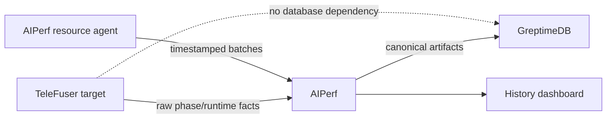

# TeleFuser 与 AIPerf Benchmark 设计

本文定义稳定职责、协议和指标语义。具体实验数值、机器地址和运行状态应保存在 GreptimeDB 与可重放产物中。

## 职责边界


```mermaid
flowchart LR
    TF[TeleFuser target] -->|raw phase/runtime facts| AP[AIPerf]
    AP -->|canonical artifacts| GT[GreptimeDB]
    AP --> UI[History dashboard]
    AG[AIPerf resource agent] -->|timestamped batches| AP
    TF -. no database dependency .-> GT
```

| 组件 | 归属 | 职责 |
|---|---|---|
| TeleFuser runtime | TeleFuser | 同步测量 target phase，暴露环境与 cache 原始事实 |
| Target adapter | AIPerf | 将 `/v1/videos` HTTP 事件转成统一请求时间线 |
| 聚合与语义映射 | AIPerf | Warmup、percentile、throughput 和 canonical metric |
| Resource agent | AIPerf | 采样目标进程树、cgroup、机器和设备资源并主动上报 |
| History API/UI | AIPerf | GreptimeDB schema、查询、跨 Run 对比和图表 |
| Contract/config/data | TeleFuser | 固定 target 能力、workload 和可复现入口 |

当前仓库只维护 batch video adapter 资产。流服务使用 LiveKit，但 AIPerf 尚无对应 adapter；在具备经过验证的
LiveKit client adapter 之前，不用 mock 或已删除的直接 WebRTC adapter 代替真实 stream transport。

## 原始事实协议

- Duration 使用单调时钟；跨进程或跨机器样本同时携带源端 UTC 时间戳。
- CUDA phase 在开始和结束边界同步目标设备。
- 数值必须有限且非负；不可用字段省略或为 `null`，不能伪造为零。
- Memory 在线协议中使用 bytes，显示层再转换为 MB/GB。
- Target 不排除 warmup、不计算 percentile、不生成跨 Run 结论。

Phase fact 示例：

```json
{
  "name": "pipeline_init",
  "seconds": 12.3,
  "memory": [{"device":"cuda:0","peak_allocated_bytes":123,"peak_reserved_bytes":456}]
}
```

软件环境至少包含 TeleFuser commit、Python、PyTorch、CUDA，以及可见 GPU 型号、compute capability 和显存。

## 聚合语义

| Scope | 示例 | 规则 |
|---|---|---|
| Event | response arrival | 保留单事件时间线 |
| Request | first output、request latency | 每个请求独立计算 |
| Run | success rate、throughput、percentile | 排除 warmup 后聚合 |

AIPerf 按交付、时延、吞吐、目标执行和资源五个稳定维度展示。实现私有字段先保留为 raw point，再由版本化
mapping 映射；无法等价的字段保持 private 或 unavailable。

## 资源与历史

Resource agent 递归观测目标进程树，时间戳在采样端产生。CPU、内存、GPU、显存和网络用量与整机容量分开；
网络接口分类和容器 attribution 必须保留可验证证据。GreptimeDB 是主动上报和 History 查询的唯一数据库
边界，失败必须显式暴露。

## 可复现性

正式比较必须固定 TeleFuser、AIPerf、模型和数据 revision，记录完整软硬件环境、workload、warmup、并发、
offload/cache/attention 设置及失败请求。OOM 是该配置的结果，不能用 mock 或 offload 结果替代。
