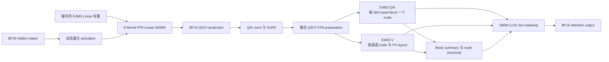
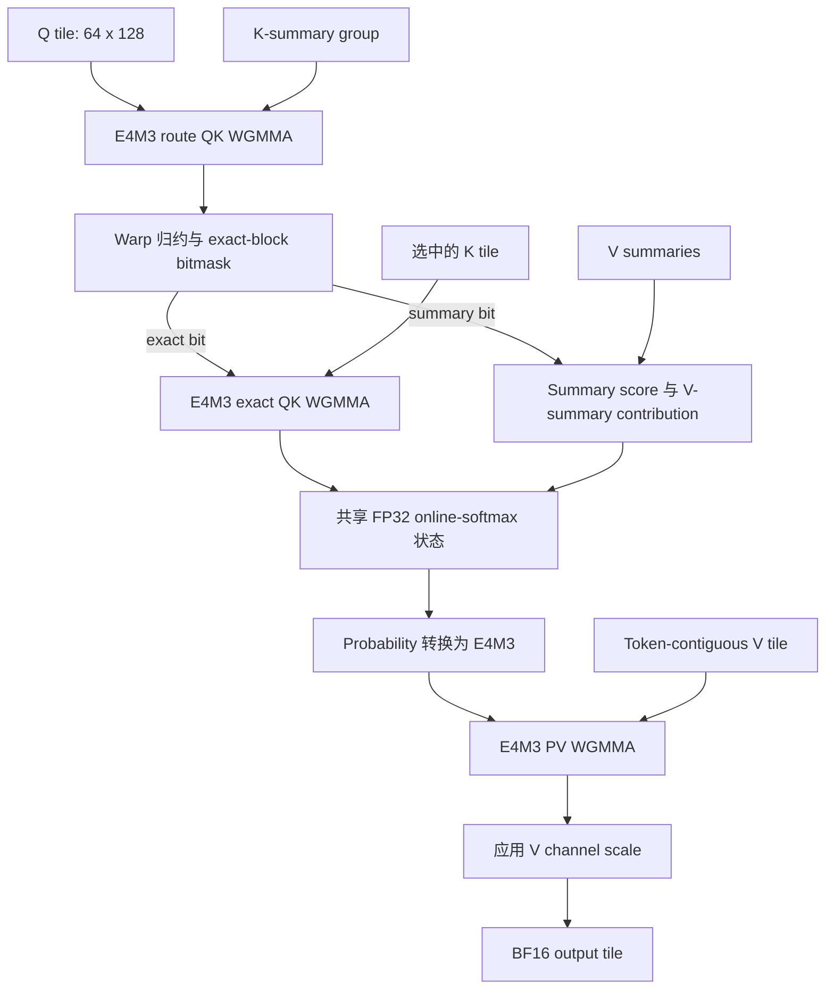

# FP8 Sol-Attn：H100 视频 DiT 的量化稀疏注意力

视频扩散 Transformer 的去噪时间主要消耗在两类矩阵乘法上：投影和 FFN 中的 Linear，以及注意力内部的
QK/PV。只量化 Linear 可以减少权重访存和模型显存，但长序列注意力仍然使用 BF16；只启用稀疏注意力
可以减少精确计算的 KV block 数量，但不会自动使用 Hopper 的 FP8 Tensor Core。

TeleFuser 将二者组合起来，同时保留清晰的实现边界：

- 源码构建的 `tf-kernel` 提供动态 W8A8 E4M3 Linear GEMM；
- TeleFuser 按注意力需求量化 post-RoPE Q/K/V，并生成对应 scale 和 V layout；
- 内置的 SM90 CuTe Sol-Attn mainloop 使用 E4M3 WGMMA 完成 route QK、exact QK 和 PV，累加使用 FP32。

Wan2.1 和 MiniMax-H3 可以分别开关 Linear FP8 与 Sol-Attn，BF16 Dense 仍是默认路径。本文说明这两类
FP8 GEMM 为什么不能互相替代、kernel 数据流如何组织、如何保护扩散生成精度，以及单张 H100 上的实测结果。

Sol-Attn 算法来自 NVIDIA Sol-Engine。TeleFuser 不声称提出了新的稀疏注意力算法、FP8 格式或 Tensor
Core 指令。这里的工作重点是把分块缩放的 FP8 operand 接入 Sol routing 和 exact attention，并在框架层
保留模型特定的 dense 区域、精确 sink、回退路径与可控配置。

## 验证快照

| 项目 | 值 |
|---|---|
| 状态 | `validated` |
| 实现 revision | `b649f0e` |
| 验证日期 | 2026-08-19 |
| GPU | 1 x NVIDIA H100 80 GB HBM3（SM90） |
| 软件 | Python 3.11.13、PyTorch 2.11.0+cu128、CUDA 12.8 |
| 可选扩展 | 为 SM90 源码构建的 `tf-kernel` wheel，用于 FP8 Linear GEMM |
| 注意力 kernel | TeleFuser 内置 CuTe DSL SM90 Sol-Attn |
| 验证模型 | Wan2.1-T2V-1.3B、MiniMax-H3 FL2VA |

下文数据是指定硬件、revision、prompt 和冷启动策略下的单点测量，不代表其他模型、序列长度、GPU 或
软件栈上的性能与质量保证。

## 边界：Linear GEMM 不等于 Attention GEMM

已有的 `tf_kernel.fp8_scaled_mm` 接收二维矩阵及其 scale。TeleFuser 用它替换选定的 `nn.Linear`：

1. 将权重按输出通道量化成 E4M3 并缓存；
2. 在运行时按 activation row 量化输入；
3. 执行 scaled GEMM，输出回到 BF16。

这个算子可以加速投影与 FFN，却不能直接执行 `softmax(QK^T)V`、动态构建 Sol route、维护 online
softmax 状态，或合并 exact 与 summary KV block。因此 FP8 Sol-Attn 不是对 `tf-kernel` FP8 GEMM 的
重复实现。它接收四维注意力 operand，并负责 QK、softmax、PV 与稀疏 route 的完整数据流。

| 路径 | 所属模块 | 输入约束 | 负责的计算 |
|---|---|---|---|
| FP8 Linear | `tf-kernel`，通过 `telefuser.ops.fp8_gemm` 调用 | 二维 E4M3 activation/weight | Projection 和 FFN GEMM，输出 BF16 |
| FP8 QKV preparation | `telefuser.ops.fp8_attention` | Post-RoPE BF16 `[B,T,H,128]` | 计算 scale、转换 E4M3、调整 V layout |
| FP8 Sol-Attn | `telefuser.kernel.sol_attn` | E4M3 Q/K/V 与 FP32 scale | Routing、exact/summary attention、online softmax、输出 BF16 |

这个边界也支持严格消融：FP8 Linear 可以搭配 BF16 Dense Attention，BF16 Linear 也可以搭配 BF16
Sol-Attn。

## 设计目标、非目标与备选方案

实现目标包括：

- 保持 BF16 Dense 默认行为不变，并让 FP8 Linear 与 FP8 attention 能够独立开关；
- 模型代码只调用 `telefuser.ops`，architecture-specific dispatch 位于 public ops 边界以下；
- QK 与 PV 都使用 Hopper 原生 FP8 Tensor Core，累加使用 FP32，输出回到 BF16；
- 不落盘完整 attention matrix 或全局 route mask；
- 支持 exact KV sink、dense step/layer guard、部分 FP8 layer range 和非对齐 token tail；
- 对不满足约束或 runtime failure 保留 BF16 fallback。

非目标包括替代 `tf-kernel` Linear GEMM、改变 checkpoint 格式、量化 text encoder/VAE、让所有 attention
variant 都使用 FP8，或声称任何 FP8 配置都必然更快。

开发过程中评估或排除了以下方案：

- **直接复用 `tf_kernel.fp8_scaled_mm` 做 attention**：二维 GEMM contract 无法表达 online softmax、动态
  routing、block sink 或 exact/summary merge。
- **FP8 Linear 后继续使用 BF16 Q/K/V**：这是有效的显存和 Linear 吞吐消融，但 QK/PV 仍在 BF16 路径，
  没有完成 attention 优化目标。
- **在 H100 上让 FP8 Q/K/V 进入 Triton reference path**：它适合 portability 与 fallback，但在生产 shape
  下的 conversion、launch 和 Tensor Core 利用率不如专用 CuTe mainloop。
- **量化所有 attention layer**：FP8 覆盖率最高，但视频出现可见退化；部分层控制保留了实测加速，并提供
  更合理的质量边界。

## 端到端数据流



这里的“融合”特指 attention mainloop，并不是声称整张计算图只包含一个 CUDA kernel。QKV 量化与
centroid preprocessing 仍是独立的 Triton kernel。CuTe mainloop 融合了最重的 route/exact QK、online
softmax 和 PV，因而不需要把完整注意力矩阵或全局 dense route mask 写入 HBM。

## 面向注意力的 FP8 Preparation

Q、K、V 在 Q/K norm 与 RoPE 之后量化。若更早量化，后续算子也必须理解 FP8 scale，而且量化边界
不再对应 attention 实际消费的数值。

每个 batch、head 和 64-token Q/K block 使用一个 E4M3 scale：

$$
s_{q,bh} = \frac{\max |Q_{b,h,64\text{-token block},:}|}{448}, \qquad
s_{k,bh} = \frac{\max |K_{b,h,64\text{-token block},:}|}{448}.
$$

V 在 token 维度上按 batch、head、channel 计算 scale：

$$
s_{v,bhd} = \frac{\max_t |V_{b,t,h,d}|}{448}.
$$

SM90 快速路径使用两个 Triton launch。第一个只读取一次 BF16 Q/K/V，写出 E4M3 Q/K 及 block scale，
并归约 V-channel 最大值；第二个把 V 直接量化到 token-contiguous backing storage。对外仍是
`[B,T,H,D]` view，但 token 维对 K-major PV WGMMA 连续，避免 attention 前再做一次 transpose。

PyTorch fallback 保持相同的公共 scale contract，使模型代码始终调用 public ops，也可以在不加载 CuTe
backend 的设备上测试。

## Sol Routing

Sol-Attn 将序列划分为 64-token Q/KV block。预处理为每个 KV block 构造 K summary 与 V summary。
`diag` 或 `exact` estimator 为每个 Q block 和 head 计算如下形式的阈值：

$$
\theta = \mu + \tau\sigma.
$$

`exact` estimator 保留完整二阶矩，`diag` 只使用逐通道方差。CuTe mainloop 让 Q 与成组的 K summary
计算 route score，再把分布在 WGMMA accumulator 中的数据归约成 CTA-local exact-block bitmask。

- 重要 block 进入 **exact route**，执行完整 QK、online softmax 与 PV；
- 其余 block 进入 **summary route**，使用 K/V summary 并校正实际 block 长度；
- 配置为 sink 的 block 无条件走 exact route。

Summary route 并不是直接丢弃 KV block，而是在同一 online-softmax 状态中保留其压缩贡献。阈值决定
多少 block 会重新提升为精确注意力。

## SM90 CuTe Mainloop

Hopper specialization 使用 64x64 QK tile、128 维 head、一个 128-thread warpgroup、TMA K/V 搬运和
WGMMA Tensor Core。FP8 路径在 BF16 Sol 结构上增加以下工作：

1. **Scale-aware route QK**：分块量化 Q 与量化 K summary 通过 E4M3 WGMMA，FP32 accumulator 在 route
   判定前乘回对应 scale。
2. **Mainloop 内构造 route mask**：warp 内归约将 route accumulator 转成紧凑 exact-block bitmask；完整
   group 与静态 tail 使用不同的编译期 specialization。
3. **Exact E4M3 QK**：被选中的 KV block 执行 QK WGMMA，输出 FP32，随后应用 scale 和 online softmax。
4. **Summary contribution**：非 exact 列消费预计算 summary，并同时校正分子、分母与当前 KV block 长度。
5. **E4M3 PV**：softmax probability 转为 E4M3，与 token-contiguous E4M3 V 相乘；全部 PV 完成后再将
   V channel scale 应用到 FP32 output accumulator。
6. **统一 online-softmax merge**：exact 与 summary route 更新相同的 row max、row sum 和 output
   accumulator，不落盘完整 attention matrix。
7. **长序列 Split-KV**：SM90 `auto` 策略在 FP8 序列长度达到 16,384 时选择两个 split，达到 65,536
   时选择四个 split，最后通过 log-sum-exp reduction 合并部分结果。



Kernel cache key 包含 device、architecture、batch、token 数、head 数、KV split 与 input dtype，避免 BF16
specialization 被错误复用于 E4M3 输入。冷启动测量也因此明确包含第一次 CuTe 编译开销。

## 扩散模型精度保护

FP8 误差和 sparse routing 误差会在多层、多步去噪中累积。TeleFuser 提供三个彼此独立的控制项：

- `dense_timesteps` 让最初、对噪声敏感的去噪步骤保持 dense；
- `dense_layers` 让每个 sparse step 的前若干 Transformer 层保持 dense；
- `sol_fp8_layer_start` / `sol_fp8_layer_end` 将 E4M3 Q/K/V 限制在半开层区间。

经过验证的 Wan2.1 配置只在第 10-19 层使用 FP8 attention。这个区间保留了性能收益，同时避免了所有
attention layer 都量化时观察到的明显画质退化。

MiniMax-H3 使用 packed multimodal sequence，因此增加了两项保护：完整 condition prefix 被注册为 exact
KV sink，prefix query 使用 BF16 dense attention 重新计算。前十个 step、前两个 DiT layer 使用匹配的
packed FlashAttention-4，token refiner 也始终保持 dense。

不支持的 shape、dtype、device 或 kernel runtime failure 会保留公共 attention fallback。FP8 operand 会先
反量化再进入 BF16 fallback。Ring/USP 仍走 dense，因为它的分布式 online merge 需要当前 Sol contract
之外的 log-sum-exp 行为。

## 性能结果

### MiniMax-H3 FL2VA

四个配置分别在单张 H100 80 GB 的独立干净进程中运行，GPU 上没有其他进程。Workload 使用官方复杂
星舰 T2VA prompt、1344x768、124 帧、24 FPS、请求时长 5 秒、50 个去噪 step 和 seed 0。计时包含首次
kernel/JIT 开销。`denoising_steps_per_second` 定义为 `50 / runtime_metrics["denoising_seconds"]`，峰值
显存为生成期间的 `torch.cuda.max_memory_allocated()`；端到端生成时间不包含 MP4 保存。

下表的 **FP8 Dense** 表示 FP8 Linear GEMM + BF16 FlashAttention-4，只有 **FP8 Sol** 会量化 Q/K/V。

| Linear | Attention | 去噪时间 | 吞吐 | 峰值 allocated | 生成时间 |
|---|---|---:|---:|---:|---:|
| BF16 | Dense FA4 | 310.409 s | 0.1611 step/s | 65.67 GiB | 457.5 s |
| BF16 | Sol-Attn | 213.442 s | 0.2343 step/s | 67.21 GiB | 321.3 s |
| FP8 | Dense FA4 | 276.836 s | 0.1806 step/s | 35.94 GiB | 397.5 s |
| FP8 | FP8 Sol-Attn | **188.185 s** | **0.2657 step/s** | **38.14 GiB** | **308.6 s** |

FP8 Sol-Attn 相比 BF16 Dense 将去噪吞吐提高 **65.0%**，峰值 allocated 显存降低 **41.9%**。相比
FP8 Dense，Sol routing 以 **6.1%** 的额外显存换来 **47.1%** 的吞吐提升。消融说明 Sol 主要减少计算量，
FP8 Linear 主要降低模型显存，组合后得到最好的吞吐/显存折中。

Sol 相比相同 Linear 精度的 Dense 会多使用 centroids、threshold、route state、output/LSE 和可选 split-KV
workspace。因此 Sol 是计算优化，并不保证 attention workspace 更小。

### Wan2.1-T2V-1.3B

Wan 冷启动实验使用 832x480、81 帧、50 个 UniPC step、CFG 5.0、sigma shift 5.0、seed 42 和官方拳击猫
prompt。计时从模型加载完成后开始，包含首次 kernel/JIT 开销，不包含 MP4 编码。两个 FP8 配置均量化
全部 300 个 Transformer-block Linear，并只在第 10-19 层使用 E4M3 Q/K/V。

这里的 **FP8 Exact** 是关闭 routing 的 exact QK/PV CuTe 路径，不是 BF16 Dense Attention。

| Linear | Attention | 吞吐 | 峰值 allocated |
|---|---|---:|---:|
| BF16 | Dense | 0.8491 frames/s | 16.147 GiB |
| BF16 | Sol-Attn | 1.1090 frames/s | 17.023 GiB |
| FP8 | FP8 Exact，第 10-19 层 | 0.8739 frames/s | 15.730 GiB |
| FP8 | FP8 Sol-Attn，第 10-19 层 | **1.1565 frames/s** | **15.730 GiB** |

FP8 Sol-Attn 比 BF16 Dense 快 **36.2%**，峰值 allocated 显存少 **2.6%**。FP8 Exact 只有 2.9% 的提升，
也说明量化必须实测：矩阵较小，或 conversion 与 launch overhead 占主导时，FP8 不会自动更快。

## 输出验证

四个 MiniMax-H3 配置均生成有效的 1344x768 H.264 视频：124 帧并带同步 AAC 音频。人工检查中间帧时，
内容连贯，没有黑帧或明显数值异常。这只是 smoke test，不是感知质量研究；不同扩散轨迹之间的 SSIM
不能解释为绝对视频质量分数。

Wan 在 matching-attention 对比下，FP8 Exact 为 22.0257 dB PSNR / 0.828783 SSIM，FP8 Sol 为
20.8502 dB PSNR / 0.792656 SSIM。选择部分 attention layer 的原因，是全层 FP8 Q/K/V 实验出现了可见退化。

正确性覆盖包括 scale forwarding、dense guard、exact sink、非对齐 token tail、constant-value
preservation、split-KV route weight、public-op fallback 和真实 H100 FP8 Sol 执行。验证 revision 的完整
单测结果为 **1,639 passed、11 skipped**。

## 复现

先通过 `tf-kernel/` 的 Makefile 构建并安装 SM90 wheel，再从 TeleFuser 仓库根目录运行。CuTe Sol-Attn
已经随 TeleFuser 源码提供。

MiniMax-H3 消融：

```bash
python -m tools.validation.benchmark_minimax_h3_quantization \
  --model-root /path/to/MiniMax-H3 \
  --backend fp8-sol \
  --prompt-file /path/to/demo_prompt.json \
  --duration 5 --steps 50 --seed 0 --aspect-ratio 16:9 \
  --output outputs/minimax_h3_fp8_sol.mp4 \
  --metrics-json outputs/minimax_h3_fp8_sol.metrics.json
```

依次将 `--backend` 改为 `bf16`、`bf16-sol`、`fp8` 与 `fp8-sol`。对比冷启动时，每个 profile 必须使用
新进程。

Wan2.1 FP8 Sol：

```bash
python examples/wan_video/wan21_1_3b_text_to_video_optimized_h100.py \
  --model-root /path/to/Wan2.1-T2V-1.3B \
  --prompt "Two anthropomorphic cats in comfy boxing gear and bright gloves fight intensely on a spotlighted stage." \
  --attention fp8-sol --quantization tf-kernel-fp8 \
  --fp8-linear-scope all --fp8-layer-start 10 --fp8-layer-end 20 \
  --width 832 --height 480 --num-frames 81 --num-inference-steps 50 \
  --sample-solver unipc --cfg-scale 5.0 --sigma-shift 5.0 --seed 42
```

## 限制

- 已验证的 FP8 attention mainloop 面向 SM90、noncausal self-attention、相同 Q/K/V shape 和 128 维 head。
  BF16 Sol 有更广的 architecture fallback，但本文性能数据不能直接迁移到这些路径。
- MiniMax-H3 在线 `tf-kernel` FP8 Linear 目前只支持单 GPU；其 TP/FSDP loading contract 仍为 BF16。
- QKV quantization 与 centroid preprocessing 是独立 kernel。进一步融合可能减少 launch 与访存开销，
  但也会提高 specialization 数量和 register pressure。
- CuTe 编译与 shape、dtype 绑定。冷启动结果包含编译，常驻服务还应单独评估 warm steady state。
- 最佳 FP8 layer range 依赖模型与 checkpoint，不能把全层 FP8 当作默认质量/性能点。
- Peak allocated 是 CUDA allocator 指标，不是进程或整张 GPU 的总显存。每个配置只有一次测量，尚未给出
  方差范围。

## 相关工作

[Sol-Attn](https://arxiv.org/abs/2607.24027) 与
[Sol-Engine 实现](https://github.com/NVlabs/Sana/tree/sol-engine) 提出了这里作为起点的动态 summary/exact
routing 算法和多架构 sparse-attention kernel。TeleFuser 将其接入 public attention dispatch、模型 runtime
state、packed multimodal sequence、exact sink 与独立量化配置。

[FlashAttention](https://arxiv.org/abs/2205.14135) 建立了基于 tiled IO-aware exact attention 与 online
softmax 的执行结构。这里的 CuTe mainloop 保留这一结构并加入 Sol routing 与 FP8 scale handling。Hopper
WGMMA、TMA 和 E4M3 算术均是 NVIDIA 硬件能力，不属于 TeleFuser 的新算法声明。

本文工作的更准确边界是一个经过端到端验证的组合：动态 W8A8 Linear GEMM、post-RoPE 分块 FP8 QKV、
面向 PV 的 V layout，以及 scale-aware routed/exact SM90 mainloop；这些能力通过可逆配置暴露，并受到完整
视频生成质量检查的约束。
