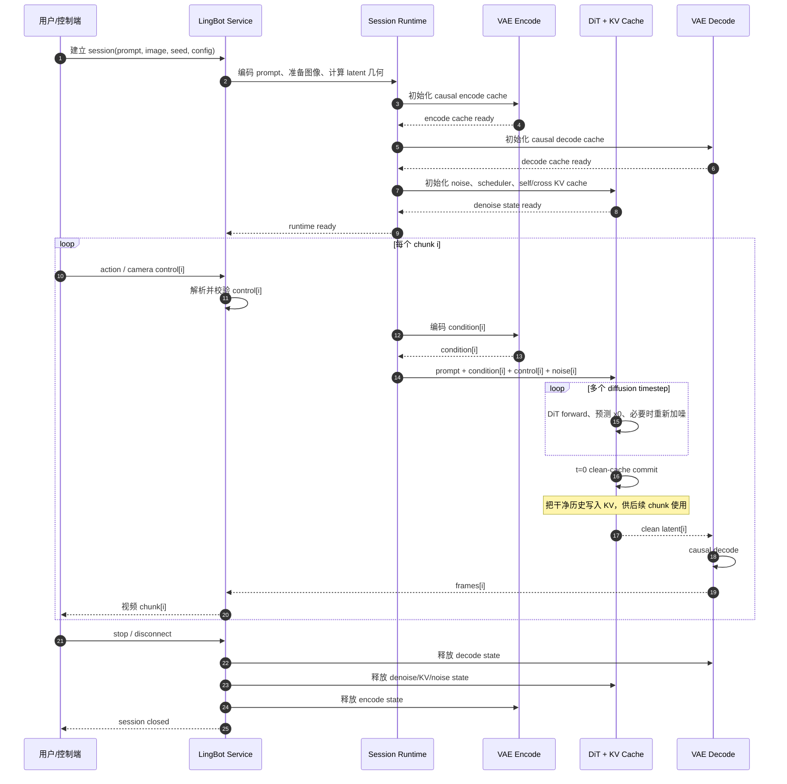
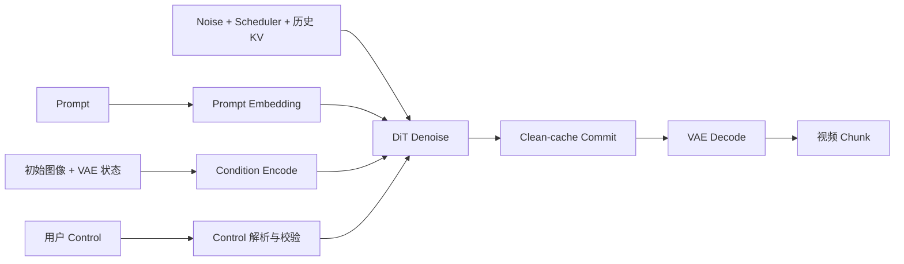
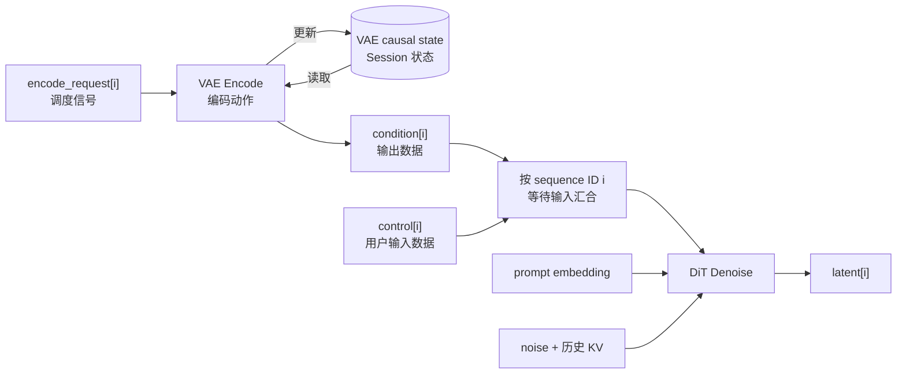
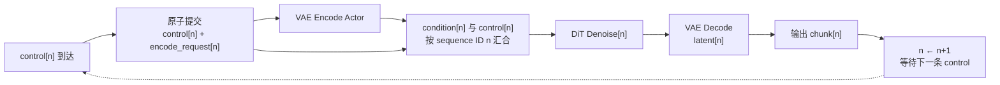
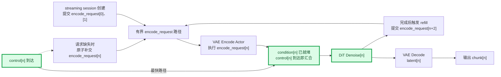
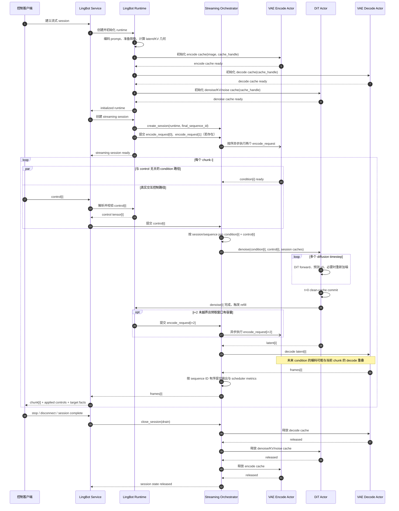

# TeleFuser世界模型推理优化记录：简单的overlap优化了蛮多

如果一个世界模型已经能持续生成视频，它就算“实时交互”了吗？不一定。

持续生成只回答了“画面能不能不断输出”。交互还要求用户发出一个控制后，下一段画面尽快体现这个控制。方向已经
改变，画面却过了一两段才响应，帧率再稳定，体感仍然会像高延迟的云游戏。

下面先梳理交互式世界模型从建立 session 到输出视频 chunk 的完整流程，再从数据依赖中定位延迟来源和优化切入点。

## 世界模型一次交互推理做了什么

LingBot-World-Fast 不是收到一条 control 就独立生成一段视频的无状态服务。它是一台持续运行、带有时间状态的
生成器：前一个 chunk 的 VAE 状态、干净 latent 和 KV cache 都会影响下一个 chunk。

一次完整 session 可以分为三个阶段。

### 1. Session 初始化

用户提供 prompt、初始图像、seed 和生成参数后，系统先建立后续所有 chunk 共享的运行状态：

- 文本编码器把 prompt 转成 prompt embedding；
- 图像被缩放、归一化，并确定 latent 的时空尺寸；
- 根据 seed 初始化 noise generator；
- VAE Encode 和 VAE Decode 分别建立自己的 causal cache；
- DiT 分配 self-attention KV cache、cross-attention cache 和调度器状态。

这些工作通常只在 session 开始时做一次，但它们决定了第一条 control 最早何时能进入模型。

### 2. 按 Chunk 循环生成

每个 chunk 都要接收用户控制、生成 latent，再解码成画面。DiT 内部还要执行多个扩散 timestep，并在最后把干净
状态写回 KV cache，供未来 chunk 使用。

### 3. Session 结束与状态释放

用户停止、断连、生成完成或某个 stage 失败后，系统必须排空或取消任务，并释放 VAE、DiT 和调度器持有的
session 状态。否则一次失败就可能留下几十 GiB 显存或长期存活的 worker。

把这三个阶段连起来，整体时序如下：



图中画的是逻辑处理顺序，不表示所有方框都必须在物理设备上串行执行。恰恰相反，调度优化的机会就藏在这些箭头
里：有些箭头代表真正的数据依赖，有些只是旧实现选择了“等上一步一起提交”。

为了先把计算职责讲清楚，上图按“初始化 → chunk 循环”的逻辑阶段展开。旧调度实际上把初始化推迟到了第一条
control 到达之后，这也是后文要处理的第一个问题。

## 理解关键路径：哪些工作真的必须等待 Control

把复杂的模型细节压缩成数据依赖，会得到下面这张图：



先把图中的几个名词拆开：

| 名词 | 在本文中指什么 |
| --- | --- |
| `chunk` | 一次流水线处理的一小段连续视频；同一个 session 中的 chunk 按 `0, 1, 2, ...` 排序。 |
| `prompt embedding` | 文本编码器对用户 prompt 生成的特征，作为 DiT 的文本语义条件。session 内 prompt 不变，因此只需计算一次。 |
| `condition[i]` | **数据。**传给 DiT 的第 `i` 个画面条件张量，由 mask 和 VAE latent 拼接而成。它是一次 VAE Encode 的产物，不是会自行推进的状态。 |
| `encode_request[i]` | **调度信号。**请求 VAE Encode Actor 为第 `i` 个 chunk 计算 `condition[i]`；它本身不包含 condition tensor。 |
| Condition 预取 | **调度动作。**在 `control[i]` 到达前提前提交 `encode_request[i]`，并允许编码结果在有界路径中等待。 |
| VAE causal state | **Session 状态。**VAE 编码前面 chunk 后保留的时序缓存，由 VAE Encode 按 chunk 顺序读取和更新。 |
| `control` | 当前 chunk 的用户控制，经相机位姿、内参以及可选 action 转换得到的模型输入。它描述接下来希望如何移动或操作，只有用户输入后才能确定。 |
| `noise` | 当前 chunk 开始扩散时使用的随机 latent。它由 session 的 seed 和随机数生成器状态依次产生，不能脱离 session 随意重排。 |
| 历史 `KV` | DiT self-attention 为已生成的干净 chunk 保存的 key/value cache。它让当前 chunk 能关注此前画面，并在每个 chunk 生成后继续更新。 |
| `sequence ID` | 调度器为 session 内每个 chunk 使用的序号，也就是上面的 `0, 1, 2, ...`。它是配对 `condition[i]`、`control[i]` 和输出的调度标识，不是模型生成的内容。 |

三者的关系是：`encode_request[i]` 触发一次 VAE Encode；VAE Encode 读取并更新该 session 的 causal state，产出
`condition[i]`。causal state 使后续编码延续同一段视频的时间上下文，而不是把每个 chunk 当作互不相关的独立
视频。DiT 则是实际执行扩散去噪的 Transformer，只有它同时拿到当前 chunk 所需的输入后才能开始计算。



因此，上图中的依赖关系可以具体理解为：

- `prompt embedding` 是 session 级输入，不需要每个 chunk 重算；
- VAE Encode 必须按 chunk 顺序推进 causal state，但提交 `encode_request[i]` 不需要等待用户的 `control[i]`；
- `control` 来自用户，不能预测；即使相邻 chunk 的控制数值碰巧相同，也必须分别对应各自的用户意图；
- `noise` 和历史 `KV` 属于 session 的生成状态，必须由该 session 自己持有；
- 对 chunk `i`，调度器可以提前提交 `encode_request[i]`，由 VAE Encode Actor 产出 `condition[i]`，同时独立等待
  `control[i]`。两项数据只需在 DiT 开始前以相同的 sequence ID `i` 汇合，彼此没有直接依赖。

最后一条就是本次优化的切入点。

## 世界模型的“快”其实有三种

在讨论优化前，还要区分三类经常被混在一起的时间：

| 指标 | 回答的问题 |
| --- | --- |
| Session startup | 从建立连接到 runtime 可用要多久？ |
| Control-to-output latency | control 被接受后，多久能看到体现它的画面？ |
| Chunk period | 相邻两个视频 chunk 的输出间隔是否稳定？ |

外层 FPS 只能描述最终产出速度，不能单独回答控制反馈是否及时。一个系统可能平均 FPS 尚可，但第一条 control
等待了很久；也可能首段很快，后续 chunk period 却追不上播放消耗。

本次改动主要缩短前两项中的非必要等待。

## 找到切入点：控制来了，系统才开始备菜

三个指标中，这里的首要优化目标是 **Control-to-output latency**：把不依赖当前 control 的工作移出“control 被接受
到对应画面输出”这条关键路径。提前创建 runtime 还会同时改善 **Session startup**，避免第一条 control 承担初始化
成本；**Chunk period** 不是本节的直接优化目标，而是优化后仍需保持稳定的约束。

### 先直观理解 Condition 预取

Condition 预取做的事情很单纯：系统在等待用户提交 `control[i]` 时，先提交 `encode_request[i]`。Orchestrator
随后异步调度 VAE Encode Actor；Actor 读取该 session 的 causal state，计算 `condition[i]`，并让结果暂存在有界
路径中。系统没有猜测用户控制，也没有提前调用 DiT 生成视频。

没有预取时，每轮都由 control 触发：



提前预取后，Denoise 完成会循环补充未来请求：



因此，预取没有减少 VAE Encode 的计算量，而是让这段计算尽量发生在用户尚未发出 control 的等待期内。如果
`condition[i]` 已经就绪，`control[i]` 到达后可以直接进入 DiT；如果它还在编码，DiT 仍会等待两项输入全部就绪。
本文最多允许两个 condition 编码任务或结果领先 control，不会一次性提交整个 session 的编码任务。

第一张图中，每一轮都必须先等 `control[n]`，再把它与 `encode_request[n]` 一起提交；输出后进入下一轮并继续等待。
第二张图中的 `n` 表示当前正在处理的 chunk。session 创建时先提交 `0` 和 `1`；进入稳定循环后，`Denoise[n]` 完成
会触发补窗，正常情况下提交 `encode_request[n+2]`。该请求被异步投递到 VAE Encode Actor，因此它的编码可能与
当前 `latent[n]` 的 VAE Decode 重叠。如果请求因 backpressure 等原因没有提前进入流水线，`control[n]` 到达时
还会触发图中的虚线兜底路径。绿色节点标出预取命中时的最快路径：condition 已在汇合点等待，control 被接受后
可以直接进入 DiT，不再经过一次 VAE Encode。

第一张图就是旧流程：`encode_request` 和 `control` 被作为一组输入原子提交。这样做很直观，也容易保证顺序，
但它把两条本来独立的路径绑在了一起：即使 condition 完全不依赖当前 control，也必须等用户操作后才能开始编码。

这就像餐厅必须等客人说“少放辣”，才开始洗菜。调味确实依赖客人的选择，洗菜却不依赖。把两件事绑在一起，
客人看到的等待时间自然会变长。

第一条 control 更吃亏：旧流程在收到它之后才创建 runtime 和 session，首个交互延迟还要额外承担 prompt 编码、
图像准备和三类 cache 初始化成本。

## 我们的改动：让两条路在 DiT 门口汇合

核心思路现在就很自然了：

> `condition[i]` 不依赖 `control[i]`，所以应提前提交它的 `encode_request[i]`；编码结果只需在 DiT 入口与
> `control[i]` 按 chunk 序号汇合。

具体改动有三项：

1. 建立 session 后立即准备 runtime，不再等第一条 control。
2. 创建 streaming session 时，立即提交最前面的两个 `encode_request`（不足两个时按实际 chunk 数量提交）。
3. 当前 chunk 的 denoise 计算完成后，从 `next_condition_index` 开始提交未来编码请求，直到补满深度为 `2` 的窗口。

### 谁发起预取，谁执行编码

这里没有一个专门轮询队列的“预取 Actor”。预取由 `LingBotWorldFastStreamingRuntime` 持有的游标和事件触发：

- session 创建时，Runtime 主动提交最前面的两个 `encode_request`；
- chunk `i` 的 denoise 计算完成后，Denoise Actor 调用 Runtime 的补窗逻辑；如果仍有容量，Runtime 从
  `next_condition_index` 开始提交请求，直到窗口补满；正常逐 chunk 推进时，第一条通常是 `encode_request[i+2]`；
- 如果 `control[i]` 到达时对应请求还未提交，`try_submit_chunk()` 会将 `encode_request[i]` 与 `control[i]` 作为一次
  原子 ingress 兜底提交。

Orchestrator 收到 `encode_request` 后检查 stage 和队列容量，再异步投递给 VAE Encode Actor。VAE Encode Actor 只
负责顺序执行编码并产出 `condition[i]`，不负责决定何时预取。补窗发生在 denoise 计算结束之后，随后当前
`latent[i]` 进入 VAE Decode，因此未来 condition 的编码更有机会与当前 chunk 的解码重叠。

把 session 初始化、condition 预取、逐 chunk 生成和状态释放串起来，完整时序如下：



图中的 `par` 表示两条路径没有直接的数据依赖，不承诺它们一定在物理设备上并行执行。如果 condition 已经准备好，
control 到达后就可以直接进入 DiT，而不用先等待一次 VAE encode。

这次优化没有修改模型权重、扩散步数、dtype、attention 实现或 VAE 数值路径。变化发生在任务何时进入流水线，
而不是张量如何计算。它带来的不是“模型算得更快”，而是减少本来可以并行、却被排成串行的等待。

## 为什么只预取两个，而不是越多越好

预取不是免费的。每个提前提交的 `encode_request` 及其产出的 condition tensor 都会占用队列位置、tensor 引用
和 session cache。如果把整个长 session 的编码请求一次性全部提交，短期延迟可能好看，内存却会随视频时长不断
增长。

TeleFuser 使用固定深度 `2` 的窗口，并为每条 tensor 路径设置 per-session 容量。一个 condition 正在编码时，
最多再允许一个任务或结果停留在有界路径中。

每个 session 维护两个简单的游标：

- `next_condition_index`：下一条尚未提交 `encode_request` 的 condition 序号；
- `next_control_index`：下一条允许接收的 control。

它们始终满足：

```text
0 <= next_condition_index - next_control_index <= 2
```

这既限制了预取规模，也让 control 的顺序变得明确。重复、跳号或乱序 control 会直接被拒绝，而不是悄悄污染
有状态 cache。

## 为什么在 Denoise 之后补充窗口

只在 session 开始时提交两个 `encode_request` 还不够。流水线向前推进后，窗口必须持续补充。

这里的“补充”不是修改某个 condition 状态，而是提交下一条尚未进入流水线的 `encode_request`。chunk `i` 的
Denoise Actor 完成模型计算和 clean-cache commit 后，会调用 Runtime 的补窗逻辑。Runtime 检查两个游标和队列
容量；满足条件时，它从 `next_condition_index` 开始向 Orchestrator 提交请求，直到窗口补满。正常逐 chunk 推进时，
第一条通常是 `encode_request[i+2]`，随后由 Orchestrator 异步投递给 VAE Encode Actor。

选择这个时机是为了避开当前 chunk 的 DiT 计算。DiT 通常是最重的阶段，如果 VAE Encode 恰好与它在同一 GPU 上
争抢资源，理论上的并行可能反而增加抖动。请求在 denoise 结束后异步发出，而当前 `latent[i]` 随后进入 VAE
Decode，因此未来 condition 的编码更有机会与当前 chunk 的解码重叠。

这里说的是调度偏好，不是硬互斥。设备放置、CUDA 调度和 backpressure 都会影响实际重叠关系。如果当前 control
已经到达，而匹配的 `encode_request` 还没有进入流水线，系统仍会补交这条请求，避免为了“完美重叠”把 session
卡死。

这里还有一条容易被忽略的边界：`can_submit_chunk()` 这样的容量查询必须是纯读操作，不能因为 service 轮询一次
就启动新的 VAE Encode。只有 `try_submit_chunk()` 真正携带 control 时，系统才允许兜底补交 `encode_request`，
而且缺失的请求与 control 会作为同一次原子 ingress 接受或拒绝，避免只提交其中一半。

## 实测结果：从 1.80 秒到 1.45 秒

固定环境为 4 张 H100、`chunk_size=3`、SageAttention SM90。以下是累计 checkpoint，不是把多个开关放在同一次
进程内做的严格单变量 A/B：

| Checkpoint | Chunk mean | 相对上一阶段 | 相对初始基线 |
| --- | ---: | ---: | ---: |
| 4 卡 SageAttention 基线 | 1.800984s | - | - |
| 首轮 condition/cache 版本 | 1.695177s | -5.9% | -5.9% |
| Condition 与 control 解耦预取 | 1.579448s | -6.8% | -12.3% |
| Post-denoise refill | 1.449961s | -8.2% | -19.5% |

最新一次 AIPerf 验证得到：

| 指标 | 结果 |
| --- | ---: |
| Mean | 1.4476s |
| P90 | 1.4903s |
| P99 | 1.5110s |
| 加权 compute FPS | 8.2898 |

AIPerf Run ID：

```text
0710537a-6302-41b2-a3b5-d1944ed7991f
```

从平均值看，累计下降约 `19.6%`。更值得关注的是 P90 和 P99：交互系统不仅要平均快，还要减少偶发的长等待。

不过，这还不能直接宣称“完全实时”。稳态 chunk 通常代表约 12 个输出帧；在 16 FPS 下，它对应约 `0.75s` 的
播放时长。要让生成长期追上播放消耗，P95 chunk period 还应稳定低于 `0.75s`，并为编码和网络传输留出余量。
目前的结果说明关键路径被明显缩短，但 DiT 本身仍是下一阶段的主要优化对象。

## 这次优化属于无损调度优化

这次修改没有减少任何模型计算，也没有使用近似结果。保持不变的内容包括：

- 模型权重和 checkpoint；
- 扩散 schedule 与 timestep；
- dtype；
- attention 实现；
- VAE encode/decode 数值路径；
- control 与 condition 的同序号对应关系；
- 最终输出顺序。

改变的只有独立任务的提交时间和重叠方式。对同一个 seed、输入和 control，计算图中的数学操作没有被删减。

## 可以容忍的代价：提前预热资源

现在 session 建立后，即使用户暂时不发送 control，系统也会提前：

- 创建 runtime；
- 初始化 VAE、DiT 和 KV/noise cache；
- 占用最多两个 condition slot。

这相当于在 session 级别做预热：先完成 runtime/cache 初始化和有界的 condition 准备，再等待真实 control。在线
推理系统普遍使用预热把初始化成本移出请求关键路径；这里最多保留两个 condition slot，收益是更短的首次控制
延迟，因此当前代价可以容忍。生产环境仍需要 session 空闲超时、断连清理和并发容量限制。

只有当系统进一步追求冷启动弹性，例如空闲时回收 runtime、按需分配 GPU 或 scale to zero，提前预热与资源弹性
之间的矛盾才会变得突出。届时可以把轻量 session 建立、runtime 激活和空闲回收拆开评估，这会成为后续独立的
优化点，而不是本次交互延迟优化需要解决的问题。

所有状态继续归属于单个 session，并由拥有对应 worker 的 actor 按 `decode → denoise → encode` 的逆拓扑顺序
释放。预取失败、stage failure、主动停止和断连也走同一套 cleanup。

## 关于 TeleFuser

TeleFuser 由中国电信人工智能研究院（TeleAI）世界模型团队和 Infra 团队共同研发，由中国电信首席科学家
李学龙教授带领。TeleFuser 是一个面向实时世界模型的高性能推理框架，支持流式生成、持续状态管理和低延迟交互，
现已[开源](https://github.com/Tele-AI/TeleFuser)。
