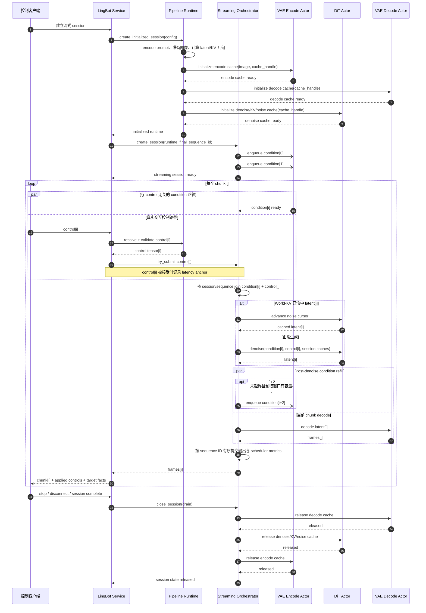
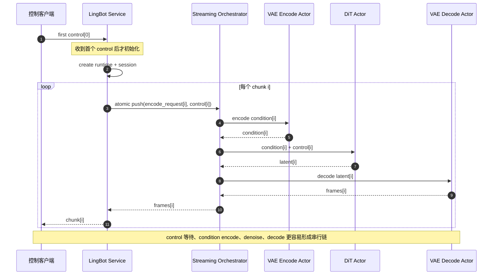
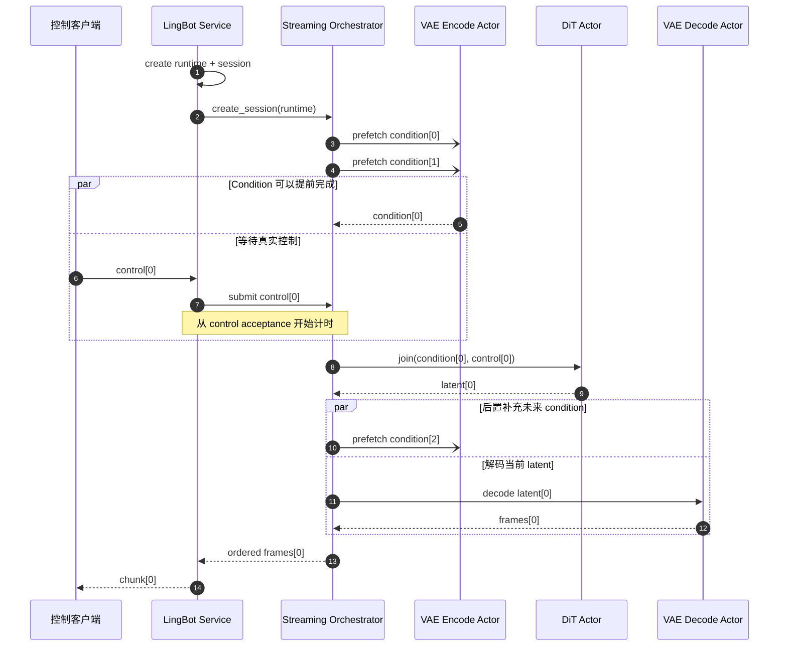

# LingBot-World-Fast Condition 预取流水设计

> 状态：当前实现设计说明。本文描述内部调度策略，不新增用户配置、环境变量或服务协议。

## 1. 最终状态：完整运行时序



图中的 `par` 表示两条路径之间没有数据依赖，不承诺它们在物理设备上同时执行。condition 可能早于 control 完成，
也可能在 control 到达后才完成；DiT 始终等待同一 sequence ID 的两项输入都就绪。

最终结构中有三条必须分开的路径：

- `condition`：只依赖 session 图像、VAE causal state 和 chunk 位置，可以在 control 之前计算；
- `control`：来自真实交互输入，必须按 chunk 严格有序，不能预测或跨 chunk 复用；
- `latent/frames`：只有同一 sequence ID 的 condition 与 control join 后才能产生。

VAE Encode、DiT 和 VAE Decode 分别由唯一 actor 管理。它们即使放在同一张 GPU 上也可以重叠；调度器不会根据
device placement 隐式创建 resource group。session 结束时，cache 通过 owning actor 按
`decode → denoise → encode` 的逆拓扑顺序释放。

## 2. 最终状态的准入与状态边界

每个 session 维护两个单调递增 cursor：

- `next_condition_index`：下一条尚未提交的 condition 序号；
- `next_control_index`：下一条允许接收的 control 序号。

预取窗口满足：

```text
0 <= next_condition_index - next_control_index <= 2
```

control 准入必须同时满足：

1. `chunk_index == next_control_index`；
2. 对应 condition 已提交，或当前仍可补交该 condition；
3. control edge 仍有容量。

只有 scheduler 接受 control 后，control cursor 才递增。重复、跳号和乱序 control 直接失败。
`_ensure_next_condition_locked()` 只在预取被 backpressure 暂时耗尽时补齐当前 control 所需的一个 condition；
正常窗口补充由当前 chunk denoise 完成后的 refill 触发。

预取深度 `2` 是内部常量，不是用户配置。condition、control、latent 和 output edge 也都具有显式的 per-session
容量，因此长 session 不会形成 duration-sized tensor 列表。Condition actor 自身仍然串行执行；两级预取表示
最多允许一个任务执行、另一个任务或结果停留在有界路径中，不表示同一个 VAE worker 同时运行两个 encode。

## 3. 本次 Diff：优化前后时序对比

### 3.1 优化前



优化前，`encode_request` 与 `control` 必须在一次原子 ingress 中提交。condition 明明与当前 control 无关，却必须
等待 control 到达；首个 control 之后还要承担 runtime/session 初始化，直接拉长第一条交互关键路径。

### 3.2 优化后



### 3.3 变化分析

| 维度 | 优化前 | 优化后 |
|---|---|---|
| 首个 control | 先等待 control，再初始化 runtime/session | 先初始化并预取，再等待 control |
| Condition ingress | 与 control 原子提交 | 与 control 解耦，最多领先 2 个 chunk |
| DiT 启动条件 | encode 在 control 后开始，随后 join | condition 可提前就绪，control 到达后即可 join |
| 后续 refill | 下一 control 到达后才触发 encode | 当前 denoise 完成后补充窗口 |
| 主要重叠 | 重叠机会少，容易形成串行链 | 未来 VAE encode 主要与当前 VAE decode 重叠 |
| Control 顺序 | 依赖原子 ingress 隐式维持 | `next_control_index` 显式拒绝重复、跳号和乱序 |
| 延迟起点 | 第一条任意 ingress | `latency_anchor_artifact="control"` |
| 内存边界 | edge 容量有界 | 保持有界，并增加固定深度 2 的 condition lookahead |

Post-denoise refill 是调度偏好，不是“VAE encode 永不与 DiT 重叠”的硬互斥保证。如果 control 已到达而匹配的
condition 尚未提交，活性保护仍可补交该 condition，以免 session 停滞。

## 4. 指标语义

Condition 预取可能早于 control 数秒。如果仍使用第一条 ingress 的时间作为起点，scheduler 会把用户尚未发送
control 的等待时间错误计入 control-to-output latency。

`StreamingPipelineSpec.latency_anchor_artifact="control"` 规定：

- condition-only ingress 不写入 `ingress_accepted_at`；
- control 被接受时才记录该 sequence 的 ingress 时间；
- 对应输出发出后，scheduler 才计算 control-to-output latency。

该字段默认是 `None`，其他 pipeline 保持“第一条任意 ingress”为起点的旧行为。它只修正 scheduler 指标语义，
不会合并 target chunk compute、客户端 delivery latency 或 AIPerf warmup/聚合职责。

## 5. 收益与代价

以下数据来自固定 4×H100、`chunk_size=3`、SageAttention SM90 的累计 checkpoint；它们不是严格的单开关 A/B：

| Checkpoint | Chunk mean | 相对上一阶段 | 相对初始基线 |
|---|---:|---:|---:|
| 4 卡 SageAttention 基线 | 1.800984s | - | - |
| 首轮 condition/cache 版本 | 1.695177s | -5.9% | -5.9% |
| Condition 与 control 解耦预取 | 1.579448s | -6.8% | -12.3% |
| Post-denoise refill | 1.449961s | -8.2% | -19.5% |

按相邻累计 checkpoint 看，post-denoise refill 是当时最大的单项下降；按正确性依赖看，应把 runtime 前置、
condition/control 解耦、两级预取、后置 refill、control 顺序和延迟锚点作为一个整体。

主要代价：连接建立后即使用户一直不发送 control，也会提前占用 runtime、三类 session cache 和最多两个
condition slot。断连、停止、stage failure 或预取失败时，仍由原有 session cleanup 释放这些状态。

本设计不改变扩散步数、模型权重、dtype、attention 实现、VAE 数值路径或输出顺序，属于无损调度优化。

## 6. 实现映射

| 设计职责 | 实现位置 |
|---|---|
| 首个 control 前创建 runtime/session | `telefuser/pipelines/lingbot_world_fast/service.py::_run_actor_worker_loop` |
| Session cursor、两级预取和 control 准入 | `telefuser/pipelines/lingbot_world_fast/streaming.py` |
| Post-denoise refill | `LingBotWorldFastStreamingRuntime::_denoise` |
| Control latency anchor | `telefuser/orchestrator/streaming_pipeline_orchestrator.py` |
| 时序、顺序与指标回归 | `tests/unit/pipelines/lingbot_world_fast/`、`tests/unit/orchestrator/` |

## 7. 验证要求

功能测试至少覆盖：

- session 创建后、control 到达前已提交两个 condition；
- denoise 完成后触发 refill，并补入下一 condition；
- 重复和乱序 control 被拒绝；
- condition-only ingress 不启动 control latency timer；
- 单 chunk、多 session、World-KV hit、stage failure 和 cleanup failure 行为不回退。

性能复测必须固定模型、分辨率、`chunk_size`、扩散 schedule、attention 实现、GPU 数量、placement 和 AIPerf
warmup 口径。正式结论至少比较多轮 mean、P90、P99、加权 compute FPS，并同时检查 GPU/VAE/DiT 时序，避免
把单轮调度抖动误判为稳定收益。
