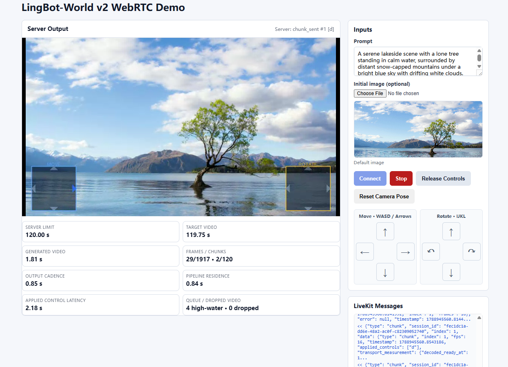
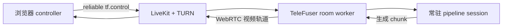

# LingBot-World v2 WebRTC 核心体验

本指南验证 TeleFuser 的核心链路：浏览器控制经 LiveKit WebRTC room 进入常驻世界模型 session，模型生成
下一段视频 chunk，并通过实时媒体轨道返回浏览器。先运行无模型传输预检，可以把 signaling、TURN 问题与
模型、GPU 问题分开定位。



浏览器 Demo 在同一页面集中展示生成视频、平移与旋转控制、session 操作、运行指标和 LiveKit 消息。

## 验证目标

| 阶段 | 是否需要模型 | 成功标志 |
| --- | --- | --- |
| WebRTC 预检 | 否 | 浏览器收到移动测试画面，按住控制键时 D-pad 同步高亮 |
| LingBot-World v2 | 是，使用下述四 H100 配置 | 相机控制在同一 room 中持续产生新的世界模型 chunk |



## 环境要求

先完成[安装](installation.md)，然后检查开发服务：

```bash
command -v livekit-server
command -v turnserver
telefuser stream-serve --help
```

浏览器 Demo 强制使用本地 TCP TURN relay。以下命令使用开发凭据和 loopback 地址，不属于生产配置。

服务命令会清理代理变量，确保本地 LiveKit SDK 直接连接 loopback signaling。

### LingBot-World v2 硬件与权重

经过验证的配置使用四张 H100。将模型库根目录设置为以下结构：

```text
${TF_MODEL_ZOO_PATH}/
├── Wan2.2-I2V-A14B/
│   ├── Wan2.1_VAE.pth
│   └── models_t5_umt5-xxl-enc-bf16.pth
└── lingbot/
    └── lingbot-world-v2-14b-causal-fast/
        └── transformers/
            ├── model-00001-of-00008.safetensors
            └── ... model-00008-of-00008.safetensors
```

加载 GPU 前先检查输入：

```bash
export TF_MODEL_ZOO_PATH=/path/to/model_zoo
test -f "$TF_MODEL_ZOO_PATH/Wan2.2-I2V-A14B/Wan2.1_VAE.pth"
test -f "$TF_MODEL_ZOO_PATH/Wan2.2-I2V-A14B/models_t5_umt5-xxl-enc-bf16.pth"
test -f "$TF_MODEL_ZOO_PATH/lingbot/lingbot-world-v2-14b-causal-fast/transformers/model-00008-of-00008.safetensors"
```

初始图片、相机轨迹和内参已经包含在 `examples/data/lingbot_world_fast/` 中。

## 1. 无模型验证 WebRTC

从仓库根目录在四个终端运行开发环境。

终端 1，TCP TURN relay：

```bash
turnserver -n -m 1 \
  --listening-ip=127.0.0.1 --relay-ip=127.0.0.1 \
  --listening-port=3478 --min-port=49160 --max-port=49200 \
  --user=livekit-demo:livekit-demo-password --realm=livekit.local \
  --fingerprint --lt-cred-mech --no-tls --no-dtls --no-cli \
  --allow-loopback-peers
```

终端 2，LiveKit signaling 与 SFU：

```bash
livekit-server --dev
```

终端 3，自包含的无模型双向服务：

```bash
env -u http_proxy -u https_proxy -u HTTP_PROXY -u HTTPS_PROXY -u all_proxy -u ALL_PROXY \
  telefuser stream-serve examples/stream_server/stream_arrow_overlay.py \
  --livekit-url ws://127.0.0.1:7880 \
  --livekit-api-key devkey \
  --livekit-api-secret secret \
  --port 8088 \
  --skip-validation
```

终端 4，浏览器 controller 与 API proxy：

```bash
python examples/stream_server/livekit_bidirectional_demo.py \
  --server-url http://127.0.0.1:8088 \
  --port 8092 \
  --no-open
```

检查 readiness：

```bash
curl --fail http://127.0.0.1:8088/v1/service/ready
curl --fail http://127.0.0.1:8088/v1/stream/health
```

打开 `http://127.0.0.1:8092` 并点击 **Start**。出现移动测试画面、按住 W/A/S/D 时对应 D-pad
方向同步高亮、点击 **Stop** 后 session 正常关闭，即表示预检通过。此步骤通过前不要启动模型。

## 2. 运行 LingBot-World v2

先停止预检 session 和终端 3，保持 TURN、LiveKit 和浏览器 proxy 运行，然后用 v2 服务替换终端 3：

```bash
env -u http_proxy -u https_proxy -u HTTP_PROXY -u HTTPS_PROXY -u all_proxy -u ALL_PROXY \
  TF_MODEL_ZOO_PATH=/path/to/model_zoo \
  CUDA_VISIBLE_DEVICES=0,1,2,3 \
  telefuser stream-serve examples/lingbot/lingbot_world_v2_image_to_video_h100.py \
  --livekit-url ws://127.0.0.1:7880 \
  --livekit-api-key devkey \
  --livekit-api-secret secret \
  --worker-gpu-map 0,1,2,3 \
  --max-sessions-per-worker 1 \
  --control-idle-timeout 10 \
  --port 8088 \
  --skip-validation
```

等待 `/v1/service/ready` 返回 HTTP 200。刷新浏览器页面，选择初始图片或使用仓库默认图片，然后点击
**Start**。满足以下条件即表示核心体验通过：

- 页面收到实时视频轨道，而不是只显示初始图片；
- 按住 W/A/S/D 或 I/J/K/L 后，新生成的 chunk 反映对应平移或旋转；
- 松开控制键后生成进入 idle，但 WebRTC room 保持连接；
- 点击 **Stop** 后 HTTP session 关闭并释放常驻模型容量。

## 远程开发

使用 VS Code Remote SSH 时，将远端 TCP 端口 `8092`、`7880`、`3478` 和 `49160-49200`
转发到本地相同端口。浏览器页面会代理 session API，因此不需要在浏览器侧转发 `8088`。

Loopback TURN listener、静态密码、禁用 TLS、`--allow-loopback-peers`、LiveKit 开发凭据和
`--skip-validation` 仅适用于可信开发主机。

## 后续步骤

- [流式服务](stream_server.md)定义 room 角色、准入、容量、生命周期和生产边界。
- [流式调度器](stream_scheduler.md)解释阶段所有权与有界 chunk 流。
- [LingBot-World Cookbook](/TeleFuser/zh/cookbook/lingbot-world/)记录离线验证和性能门槛。
- [基础推理快速上手](quickstart.md)提供更小的单卡安装与批量 API 检查。
